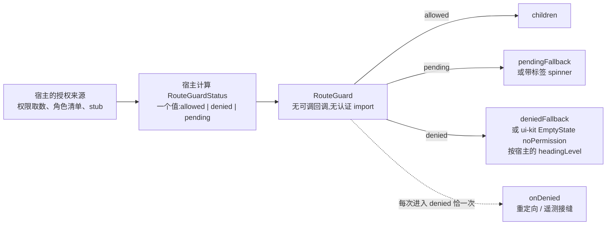

# layout-kit:无导航逻辑的应用外壳

`@speed/layout-kit` 是共享应用外壳层:`AppShell`(固定页头、响应式导航抽屉与 `main` 内容区)与 `RouteGuard`(由宿主注入状态驱动的路由/内容闸)。两者都与 `@speed/ui-kit` 同处与认证无关的地基层:这里不住业务、租户或认证机制语义。这个包的定义性属性是它拒绝知道什么——导航状态、授权来源、路由器——两个组件的契约就是把这些拒绝变成形态。

## 职责与边界

- **永不匹配路径。** `navItems` 是宿主完整算出的列表,*包括*哪个条目 `selected`;AppShell 从不拿 location 与条目比较,因为不同宿主用不同路由器,包若自己做匹配等于重复各家路由器的逻辑——还容易微妙地做错。
- **无路由器、无认证包,任何地方都没有。** 包只依赖 `@speed/i18n` 与 `@speed/ui-kit`。`RouteGuard` 的放行/拒绝/待定裁决以普通 `status` 值抵达——绝不是包去调用的回调,绝不是认证或路由 import——一个包、两种授权来源,prop 形态不变。
- **不直接依赖 `@speed/tokens`。** AppShell 经宿主 `AppThemeProvider` 已建的 MUI 环境主题读 `breakpoints.values` 与 z-index。这之所以安全,*正因为*令牌包的对等钉测——那些行是 MUI 同默认值,主题里不缺任何与布局相关的东西。
- **唯一的具象耦合是 ui-kit 的 `EmptyState`,且只作拒绝兜底**——外壳复用原语而已。
- **文本归包自己的 `layout-kit` 命名空间**(四个键:跳转链接、导航标签、开/关标签、待定 spinner 标签),与每个姊妹包一样由宿主注册;拒绝兜底自身不带文本,按设计如此。

## 设计:AppShell——主题作决定,宿主作其余决定

AppShell 是固定 `AppBar`、导航 `Drawer` 与 `main` 地标。响应式拆分由环境主题*自己*的断点驱动——`useMediaQuery(theme.breakpoints.up('md'))`,`md` 及以上常驻抽屉、以下临时浮层——不引入任何新断点,因为外壳必须跟随宿主组装的任何主题,而非发明自己的刻度。跳至内容链接是壳里第一个可聚焦元素,直接聚焦 `main` 地标,绝不走片段导航——片段会改写 `location.hash`,弄丢 hash 路由宿主的当前路由。

移动抽屉可选受控(`mobileOpen`/`onMobileOpenChange`);省略成对参数则由 AppShell 自管开关——唯一一处交互本地例外,刻意对齐 ui-kit `ConfirmDialog` 武装的小切口——不受控的临时抽屉在激活导航条目时也自行关闭。

窄视口保护纯 CSS 且不加 props:移动抽屉纸面宽度以 `min(sidebarWidth, 85vw)` 封顶,极窄视口永远得不到近乎全屏的抽屉;页头行在真实溢出压力下换行而非被裁切。换行不是自动折叠溢出菜单——发明那个会是本包在别处回避的新宿主行为。因为换行后的页头比主题工具栏行更高,外壳测量横幅的真实渲染高度(可用 `ResizeObserver` 处),让偏移占位随测量派生,无观察器处回退主题工具栏高度。

## 设计:RouteGuard——裁决是值,不是回调

`RouteGuard` 以宿主算好的 `status: 'allowed' | 'denied' | 'pending'` 值闸 children。两条理由让值的形态承重。其一,包不可能知道授权来源——真权限取数、角色清单、测试里的 stub——所以它必须收*结果*,绝不调用来源。其二,一个来源的一个值让三态按构造互斥:不存在可能与 "allowed" 打架的独立布尔 loading 标志,那是值形状态表达不了的失败模式。每态默认渲染:children、带标签的 spinner(`pendingFallback` 可覆盖)、或 ui-kit 的 `EmptyState variant="noPermission"`——默认以 `h1` 渲染,因为闸替换了它所守的页面内容;`headingLevel` 延续标题先于闸的页面的标题序而不跳级。`onDenied` 每次*进入* `denied` 恰触发一次——以 status 为键的 `useEffect` 加守卫,重渲染而 status 停在 `denied` 不会重触发——这是给宿主重定向或遥测的接缝,与渲染完全解耦。

消费者证明值入契约:参考应用从服务端应答的笔记查询推导闸状态——被拒的读(403)把闸 fail-closed 到 `denied`——product-shell 的套件以替身宿主附着的角色清单驱动同一形态。状态永远经宿主组装抵达,绝不来自包代码。

## 对外的稳定面

`AppShell` 及其 props(`navItems` 带宿主计算的 `selected`、`header`/`headerActions`/`userMenu` 槽、可选的 `mobileOpen`/`onMobileOpenChange` 受控对、`sidebarWidth` 默认 280、`sx`);`RouteGuard` 及其 props(`status`、`pendingFallback`、`deniedFallback`、`headingLevel`、`onDenied`);`RouteGuardStatus` 联合;`LAYOUT_KIT_NAMESPACE` 常量与 `layoutKitResources` 包。

## Source

- 设计:[docs/internal/12-frontend.md](https://github.com/vislake/speed/blob/main/docs/internal/12-frontend.md)(包分层、受控组件、双语文本)
- 包契约:[web/packages/layout-kit/README.md](https://github.com/vislake/speed/blob/main/web/packages/layout-kit/README.md) 与 [web/packages/layout-kit/AGENTS.md](https://github.com/vislake/speed/blob/main/web/packages/layout-kit/AGENTS.md)

## 相关页

- [前端架构](/zh-cn/docs/developer-docs/frontend-architecture/)——本包所属的与认证无关地基层
- web 组:[组导览](/zh-cn/docs/developer-docs/modules/web/)、[ui-kit](/zh-cn/docs/developer-docs/modules/web/ui-kit/)(它的拒绝兜底与主题)、[i18n](/zh-cn/docs/developer-docs/modules/web/i18n/)(它的命名空间)
- 使用视角:[用户指南中的 @speed/layout-kit](/zh-cn/docs/user-guide/modules/web/layout-kit/);它的首个消费者:[用户指南中的 @speed/product-shell](/zh-cn/docs/user-guide/modules/web/product-shell/)
