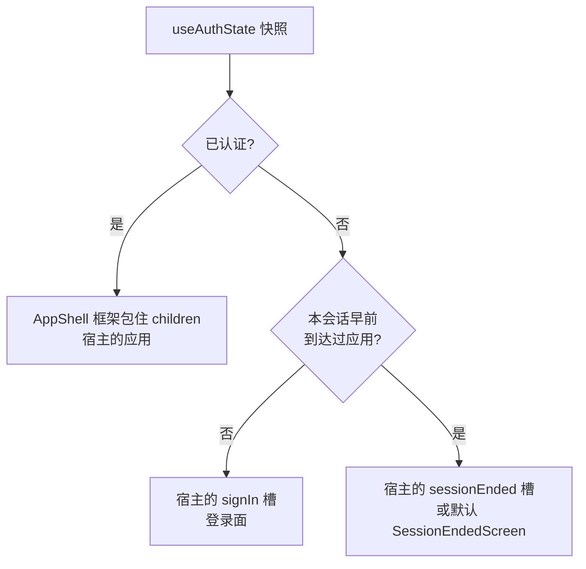

# product-shell

`@speed/product-shell` 是面向租户客户的组装壳:把共享应用框架
(`@speed/layout-kit` 的 `AppShell`)、登录组件族(`@speed/auth-ui`)
与无头会话 hooks(`@speed/auth-core`)组装成一个三分支视图机的包
——面向租户客户的业务应用随手可抄的前门。同层的平台员工壳刻意不
造。[用户指南的 product-shell 页](/zh-cn/docs/user-guide/modules/web/product-shell/)讲怎么用;
本页讲为什么。

## 职责与边界

`ProductShell` 依据它经 auth-core hooks 读到的已认证快照渲染三分
支之一:

壳只读快照、绝不驱动会话;它的边界正是组装壳容易被诱惑去做的事的
反面:

- **不自持任何权限门禁。** 它不消费 `RouteGuard`,不调用
  `usePermission`,不 attach 权限清单——路由级授权是 `children`
  里的宿主组合,status 由宿主从它 attach、并在切换租户时重挂的清
  单派生。
- **没有自己的租户切换器。** 切换租户是会话操作;宿主把
  `@speed/tenancy-ui` 的 `TenantSwitcher` 组合进 `userMenu` 槽。
  包甚至不依赖 tenancy-ui——它只是套件的 dev-only 同伴。
- **不做路由匹配。** 导航选中态在 `navItems` 里由宿主算好、
  `selected` 在内;壳从不看 URL。
- **无网络、无导航、无会话调用。** 组合视图发出的每个请求都是经宿
  主绑定客户端的会话操作。

## 为什么壳要作为组件存在

第三支是壳成为组件、而非每个应用里两行 hooks 的理由:**在应用内的
用户登出后,绝不能回落成新访客的登录面**。壳在组件状态里按会话记
住"到达过应用";会话本身留在 auth-core,不挂任何视图。因为机器分
不清服务端会话死亡与显式登出——两者是同一个快照翻转——每次翻进会
话结束视图都经 `role="status"` 实时区自我播报,而每次分支翻转都把
焦点移进分支自己的容器(一个可聚焦、不进 tab 序的 wrapper):整页
切换的无障碍义务由壳承担,而不是丢给每个宿主页面。

两个"不"的决定随之而来:

- **没有默认登录面。** 频道组合(密码、短信、社交、注册)是产品决
  策,所以"应用前匿名"分支渲染宿主的 `signIn` 槽——没有槽就什么
  都不渲染。机器绝不重置进一个会渲染空白的分支:会话结束屏的动作
  把观看者送回登录视图,所以没有 `signIn` 槽、会话中途死掉的宿主
  会留在结束屏,直到它自己给出出路。
- **切换器是组合,不是代码。** quick start 的多租户 userMenu——
  `useCurrentTenant` 喂切换器的 `currentTenantId`,已提交的切换经
  `onSwitched` 上报——是宿主义务的打包证据;gated-journey 套件真
  实扮演这份义务:fixture 宿主把 `RouteGuard` 挂在 `children`
  里,status 来自它 attach 并在切换时重挂的清单,证明门禁值来自宿
  主组合、绝不来自包代码。登录前 hooks 失败即拒,切换器显示无当
  前租户文案并禁用——无租户可切。

## 为什么 namespace 注册是宿主的事

壳只渲染自己的一句话——会话结束翻身的 `announcements.sessionEnded`
播报——来自双语 `product-shell` namespace。框架上其余文案来自
layout-kit 与 auth-ui namespace,宿主反正要注册。壳不能自己注册
namespace,任何包都不能:i18n 实例是宿主在渲染前、bootstrap 时创建
的单一实例,而 `registerNamespace` 在变更前校验同键、且每个实例只
能跑一次。注册因此是宿主清单里的一步;只有 namespace 已注册时播报
才渲染,未注册的宿主保留焦点转移、不会得到裸 key 文本——播报是增
强,不是对宿主 i18n 配置的要求。`sessionEnded` 槽有同样的可选性:
没有槽时渲染默认的 auth-ui `SessionEndedScreen`;自定义节点原样渲
染、自找出路。

## 对外稳定面

`ProductShell` 及其 props 类型——每个 `AppShell` chrome prop
(`navItems`、`header`、`userMenu`……)原样透传、`signIn` 与
`sessionEnded` 槽、`children`——加
`PRODUCT_SHELL_NAMESPACE`/`productShellResources` 对。依赖只有被
组装的部件:layout-kit、auth-ui、auth-core 与 i18n。不要求任何路
由、状态或查询库——`children` 自带。

## 相关页

- [前端架构](/zh-cn/docs/developer-docs/frontend-architecture/)——包分层与组装层
- [auth-ui 设计](/zh-cn/docs/developer-docs/modules/web/auth-ui/)——填充壳登录分支的登录家族;[tenancy-ui 设计](/zh-cn/docs/developer-docs/modules/web/tenancy-ui/)——宿主组合进 `userMenu` 槽的切换器;[account-ui 设计](/zh-cn/docs/developer-docs/modules/web/account-ui/)——已登录的区块家族
- 用户指南:[product-shell 模块](/zh-cn/docs/user-guide/modules/web/product-shell/)、[前端构建域](/zh-cn/docs/user-guide/domains/frontend-building/)
