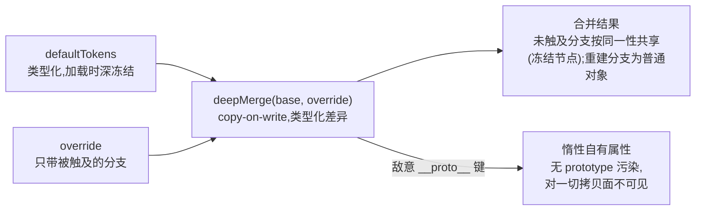

# tokens:以冻结数据承载的设计令牌

`@speed/tokens` 是平台的设计令牌树,形态为零依赖纯数据:类型化的 `defaultTokens` 装配,以及宿主借此覆盖令牌树的 `deepMerge` 机制。零运行时依赖,无 React,无 CSS-in-JS——消费者只 import 数据与类型。它是前端依赖地板的底层,其设计大半围绕它之上一切所依赖的两个不变量:默认树永不改变;必须与 MUI 一致的行不能悄悄漂离 MUI。

## 职责与边界

- **拥有值,不拥有语义。** 这棵树回答*产品长什么样*——颜色、字体、间距、形状、断点、z-index、阴影。它不决定这些值如何抵达浏览器:主题适配是 `@speed/ui-kit` 的事;把它留在这个包之外,才让想改调色板的消费者不必 import 任何带 React 的东西。
- **不渲染任何内容、不产出任何语言。** 无组件、无钩子、无用户可见文本、无 locale 文件——令牌树没有语言。
- **不随包带 MUI。** 下面的对等测试把 MUI 真 `createTheme` 作为 dev-only 依赖 import,包因此保持零运行时依赖,同时仍把自己钉在真东西上。
- **不执行产品策略。** 这里没有"租户可否覆盖 `primary.main`"一说——覆盖机制对任何调用方敞开;谁能提供一层是宿主侧的问题。

## 设计:默认树按构造冻结

`defaultTokens` 装配一次,模块加载时深冻结;类型把每个 section 标为 `readonly`。不可变因此由运行期强制,而非约定:经 `defaultTokens` 本身、或经与它按同一性共享分支的合并结果写入,在严格模式下抛错,而不是悄悄污染每个覆盖都从它出发的树。冻结之所以要紧,是因为 `deepMerge` 是 copy-on-write:基座未触及的分支保持同一性,合并结果确实与默认树共享节点。若这些共享节点可写,一个宿主不小心的改写就会在同一 bundle 里腐坏所有其它消费者的基座。冻结把这种失败模式从静默腐坏变成当场抛错。

## 设计:`deepMerge` 住在这里,合并是类型化差异

合并定义在 `SpeedTokens` 类型*之上*(`TokensOverride = DeepPartial<SpeedTokens>`),`tokens` 是它刻意的家:当前唯一消费者是令牌工厂,把合并放进带 React 的包,会逼纯令牌消费者为一次调色板覆盖付 React 的账。语义全部由测试钉住:不改输入;后覆盖者胜;纯对象递归合并,数组与标量整体替换;`undefined` 覆盖值跳过,部分覆盖永远无法清空一个令牌;基座的每个自有键在省略它的覆盖后依然存活。两个细节值得点名:

- **敌意 `__proto__` 键落为惰性自有属性。** 令牌层可能来自宿主未亲手书写的资料,天真合并会让这种键污染结果的 prototype——再经后续拷贝污染一切下游。在这里它被深合并但对每个拷贝面不可见,结果的 prototype 与任何 `Object.assign`/展开都污染不了。
- **形状漂移是编译期错误。** 覆盖是类型化差异,未知 section 或本该十六进制处给了字符串,失败在 `tsc`,绝不会是拼错键在运行期被静默丢弃。

## 设计:MUI 对等行钉在活主题上

令牌 section 刻意结构化,让 `createAppTheme` 无需扭曲即可把它们映射到 MUI 主题上。某些行*按契约相等*——间距单位(8)、`breakpoints.values`、`zIndex.values`——这些行在测试里钉住 MUI 自己的活默认值:测试 import MUI 的真 `createTheme`,把令牌行与活默认值比较。过期的树内期望只能与它抄来的令牌一致,所以改动默认值的 MUI 大版本在这里、在令牌包里就失败——早于任何主题适配器悄悄交付错的外观。唯一刻意的偏差以同样方式记录:`shape.borderRadius` 随包带 8 而 MUI 默认 4,若 MUI 默认值某天收敛到令牌值,有一条测试会失败——偏差是决定,不再是偏差的决定会被逮住,而非悄悄吸收。真正属于适配器决定的映射行(中性斜坡到 `palette.grey`、阴影、排版角色)如实记为适配决定,在 ui-kit 里映射,不在这一层硬拗。

## 对外的稳定面

`SpeedTokens` 类型及其 section 词汇(角色、斜坡步、槽位);`defaultTokens` 的装配形态与取值,冻结;`TokensOverride`/`DeepPartial` 差异类型;以及上文列全的 `deepMerge` 语义——不改输入、copy-on-write、跳过 `undefined`、数组整体替换、后者胜、忠实复制基座。包导出只有数据与类型。

## Source

- 设计:[docs/internal/12-frontend.md](https://github.com/vislake/speed/blob/main/docs/internal/12-frontend.md)(包分层与主题路径)
- 包契约:[web/packages/tokens/README.md](https://github.com/vislake/speed/blob/main/web/packages/tokens/README.md)

## 相关页

- [前端架构](/zh-cn/docs/developer-docs/frontend-architecture/)——令牌树在层图中的位置
- web 组:[组导览](/zh-cn/docs/developer-docs/modules/web/),然后 [ui-kit](/zh-cn/docs/developer-docs/modules/web/ui-kit/)——消费这棵树的主题工厂
- 使用视角:[用户指南中的 @speed/tokens](/zh-cn/docs/user-guide/modules/web/tokens/)
