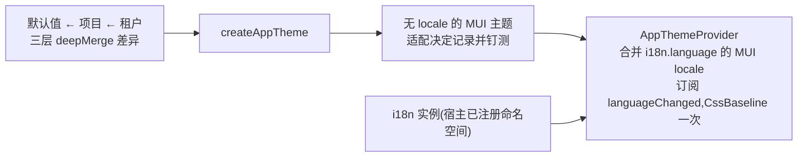

# ui-kit:主题适配器与受控组件

`@speed/ui-kit` 是 web 组第一个渲染 DOM 的包。它有两半:主题工厂(`createAppTheme`、`AppThemeProvider`),把合并后的 `@speed/tokens` 树映射成 MUI v9 主题;以及七个受控核心组件(`PageHeader`、`EmptyState`、`ConfirmDialog`、`FormField`、`FormLayout`、`DataTable`、`FileUploader`)。两半存在的理由都是回答同一个问题——平台的外观与交互原语如何抵达浏览器——而这个问题不允许其下各包自己回答。主题与原语之上的一切——屏幕、流程、数据——都是宿主组装。

## 职责与边界

- **拥有适配决定,不拥有令牌值。** 令牌树已把按契约相等的行钉在 MUI 上;这里剩下的是其余部分的映射,而且每个映射决定在本包内记录并钉测,而非即兴为之。
- **组件只渲染宿主给的状态。** 排序、选择、分页与过滤以回声状态加回调出现;组件绝不取数、存储、导航或裁决租户。`FileUploader` 把这条契约推到极限:队列渲染宿主的 `rows` prop,上传传输——校验、并发、中止——是宿主代码,组件在报告它的那个事件处理器之后不再持有 `File`。理由是结构性的:包代码不可能知道宿主的路由、身份或数据流,只渲染给定状态才让组件在任意宿主中正确、无服务器也可测。
- **不随包带屏幕与业务组件。**
- **文本归自己的命名空间,绝不内联进代码。** 内建字符串渲染自双语 `ui-kit` 命名空间,工作区 `speed/no-literal-text` 规则拒绝写在包 `src` 里的用户可见文本。宿主注册自己的双语包对来改词;宿主内容(标题、列头)是宿主自己的翻译面。
- **提供者不注册任何东西,只包主题。** `AppThemeProvider` 刻意不渲染 `I18nextProvider`、不注册命名空间——两者都属于宿主引导。
- **可访问性是逐组件的性质,每个测试都跑 axe 审计**——两处记录的例外理由都是结构性的:`color-contrast`(jsdom 不算布局与颜色,而对比度住在令牌包钉住的主题里)与 `region`(被测单元是组件,不是整页)。标题结构是一等 props(`headingLevel`、真 `h1`),因为只有宿主知道页面的顺序。

## 设计:主题工厂在记录偏差处映射

令牌层是依序应用到内建默认值之上的差异:`createAppTheme(projectTokens, tenantOverrides)` 经令牌包的 `deepMerge` 以 copy-on-write 合并,再把合并树映射到 MUI 主题面。相等行逐键直映;适配行记录自己的决定——中性斜坡变 `palette.grey`,沿用 MUI 自己的 A100–A700 别名,没有 MUI 槽位的 950 色调留在令牌侧;字号落到变体角色;六个高度槽向下取整进 MUI 的 25 槽阴影斜坡,绝不超出设计刻度——插值会发明设计从未指定的阴影。返回的主题刻意不含 locale:MUI 内建文本(分页、tooltip)携带语言,所以 locale 合并在渲染期进行。`AppThemeProvider` 把活动语言的 MUI locale 合并进基主题、订阅 `languageChanged` 让 MUI 文本跟随每次切换,并渲染一次主题感知的 `CssBaseline`。不在 MUI locale 表内的语言永不渲染中途抛错:MUI 内建文本回退其 en-US locale,应用自己的翻译继续以活动语言渲染。

## 设计:完全受控,以及例外为何保持极小

"无本地状态"规则只有一个点名的小切口:`ConfirmDialog` 的双重确认武装,一种对话框关闭即重置的交互状态。武装存在是因为破坏性确认必须扛得住双击:第一次点击给按钮换标签,第二次才触发 `onConfirm`,而 `CONFIRM_ARM_LOCKOUT_MS` 窗口(600ms)刻意长过平台双击阈值,两次快击跳不过这道闸。

两条组件契约值得把设计讲透:

- **`DataTable` 拒绝重排或重切所收到的数据。** 按契约,`rows` 就是宿主此刻想展示的集合。隐式的客户端二次排序会腐坏宿主刚取来的服务端页;切片会藏起分页计数仍在数的行。因此排序与过滤以回声状态加回调出现,由宿主把排序作用到它传入的数据上。横向滚动容器与可选列 `priority` 回流是钉测契约——共享刻度断点上的纯 CSS,绝不是 JS 布局决定。
- **表单族的错误文本只在一个命名空间里解析。** `FormField` 把属于 ui-kit 命名空间键的校验消息渲染成它的翻译;其它一切——宿主已本地化的文本、宿主特定代码——原样渲染。ui-kit 从不猜别的命名空间的码。

## 对外的稳定面

`createAppTheme` 及其两个可选令牌层;`AppTheme`(合并令牌树加无 locale 主题);`AppThemeProvider` 及其 props(i18n 实例、令牌层、children);七个组件按文档的 prop 契约;`UI_KIT_NAMESPACE` 常量与 `uiKitResources` 包;校验错误文本契约与 `REQUIRED_ERROR_KEY`;`headingLevel`/`emptyHeadingLevel` 义务;以及工厂测试钉住的已记录适配决定。

## 相关页

- [前端架构](/zh-cn/docs/developer-docs/frontend-architecture/)——本包所源的受控组件线索
- web 组:[tokens](/zh-cn/docs/developer-docs/modules/web/tokens/)、[i18n](/zh-cn/docs/developer-docs/modules/web/i18n/)——它所映射的树与命名空间;以及 [layout-kit](/zh-cn/docs/developer-docs/modules/web/layout-kit/),其拒绝兜底正是本包的 `EmptyState`
- 使用视角:[用户指南中的 @speed/ui-kit](/zh-cn/docs/user-guide/modules/web/ui-kit/)
