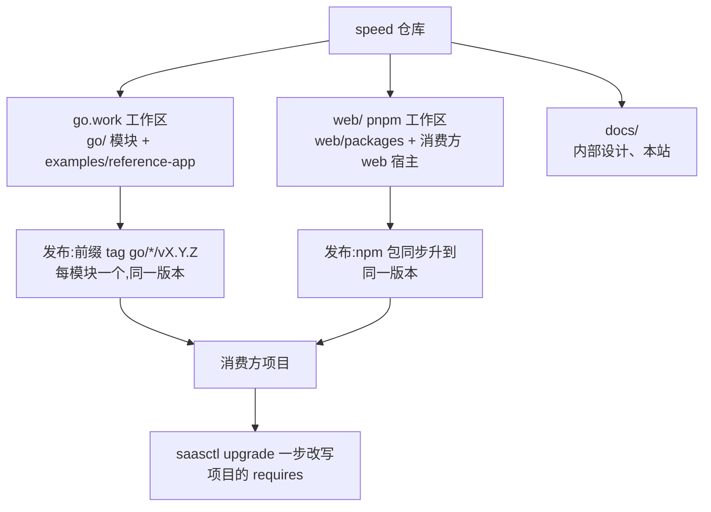

# 仓库与发布

`speed` 是一个 monorepo,内有两条刻意不重叠的工作区根,并且所有
交付物在同一个版本号下发布。本页解释布局、版本策略与两者背后的理
由——既给在仓库里工作的开发者,也给想弄清自己依赖了什么的消费方
项目。

## 一个仓库,两条工作区根

仓库根是 Go 工作区(`go.work` 列出 reference app 与 `go/` 下的全
部模块);前端半边是根在 `web/` 的 pnpm 工作区,有自己的 lockfile。
两条根永不重叠,是故意的:Go 工具会遍历模块根,pnpm 的 workspace
协议要一个自己的根,Go 侧永远不需要解析 npm 包、npm 侧永远不需要
Go 模块——共用一个根只会招来跨工具混乱。CI 镜像同一边界——Go 检
查从模块目录跑,npm 检查从 `web/` 跑。

`go/` 下的模块目录是后端的发布单元。每个都是独立 Go 模块,自带
`go.mod`、自己的 `AGENTS.md`,有迁移、语言文件与 API fragment 的
模块还把那些带在身边——不是服务,是*库*,编译进组装应用自行构建
的二进制里。两条打包规则随之而来:实现细节放 `internal/`,消费方
import 不到;后端实现永不与它实现的接口同包——二进制带哪些后端是
应用的决定,而接口可以在不拖进任何后端依赖的情况下被 import。

## 锁步版本,以及为什么

所有 Go 模块与所有 npm 包共享**同一个版本号、一起发布**。只支持同
版本组合;"tenancy v1.2 配 billing v1.5"不存在。简化就是目的:发布
退化为一次事件,不需要逐模块影响分析;CI 只验证一种组合,而不是指
数级的兼容矩阵;菱形依赖冲突不可能出现,因为每个模块要的都是同一
版本;"你们用的是什么版本"在支持对话里是一个数字。

代价被明确接受。消费方升级是整体升级——由工具缓解:`saasctl
upgrade` 一步把消费方 `go.mod` 里的 speed requires 改写到目标版
本,逐字节保留、幂等;npm 侧经 changesets fixed 组骑同一个版本。
某模块在一个发布里没有任何改动也照样升版——可接受的噪音,changelog
里标注。破坏性变更集中在大版本,配升级指南。

多模块发布机制由 Go 规则与统一版本共同决定:每个模块打子目录前缀
形态的 tag `go/<module>/vX.Y.Z`,整个计划——每个模块、每个包、同
一版本——由发布协调器(`tools/release/lockstep-release.py`)运行时
推导,只有计划一致才退出 0:版本语法合规;同版本既有 tag 的检查
——存在只出 `[warn]`(未完成发布的重跑指纹),绝不失败;`go.work`
模块表与目录树双向完备;npm 版本统一;changesets fixed 组恰好覆盖
现存包。脚本化验证不可谈判,因为手工给多模块发布打 tag 正是人最容
易出错的那一步;reference app 按设计排除在发布集之外——它是仓库
的消费方模块、证明形态,从来不是交付物。一次真实发布先跑这套验证
与协调器自带测试,随后对已验证版本执行发布——推送该版本的模
块 tag 与仓库根 tag,并把 `web/packages` 下每个 `@speed` 包发布到
GitHub Packages registry;每一步对重跑幂等(既有 tag 跳过,已发布
版本经 registry 探测跳过)。npmjs.org 发布仍延期。本地用
`task release:plan VERSION=vX.Y.Z` 跑同一检查。

## 质量门

守护仓库的检查,简而言之的形状:模块与包集合的逐项腿(lint、vet、
race 下的单元测试、工作区与独立构建);仓库级检查——架构纪律
semgrep 规则、租户隔离覆盖、i18n 键一致性、工具链漂移门与工作区
ESLint 规则自己的测试;Docker 承载的集成层(经 testcontainers 的真
实 PostgreSQL、Redis、RustFS)与 reference-app 套件,含双副本分布
式启动证明;文档与 i18n 检查;spec 工具链的全量再生成并对已提交生
成物跑 porcelain 比对;依赖、密钥与许可证扫描;以及脚手架证明——
物化一个生成项目,在两种部署模式下 tidy、构建、迁移并启动。

两条规则给这套检查以牙齿:每个已实现模块与包都真实通过自己的腿;
而 mandatory-first-consumer 规则意味着没有真实使用者的模块 API 不算
完成——reference app 端到端地行使每个模块,消费方形态的证明跑在真
实生成项目上。

## 文档随代码分发

文档跟着代码到同一个版本。每个模块与包把自己的权威文档带在身
上——随模块分发的 `AGENTS.md`(把 AI agent 当一等读者来写:边界、
公开 API、以祈使句写的禁止事项)加面向使用者的材料。设计理由与实
现代码同仓记录,本站各页——本页在内——从那些记录提炼,任何论断
都能回到底层核验。站点页面以英文与中文双语撰写。

## Source

- [Taskfile.yml](https://github.com/vislake/speed/blob/main/Taskfile.yml)——
  计划内命令,含 `release:plan`。
- [发布协调器](https://github.com/vislake/speed/blob/main/tools/release/lockstep-release.py)——
  离线单版本计划验证器。
- [web/.changeset/config.json](https://github.com/vislake/speed/blob/main/web/.changeset/config.json)——
  npm 固定版本组。
- [saasctl AGENTS.md](https://github.com/vislake/speed/blob/main/go/saasctl/AGENTS.md)——
  消费方 CLI(`new`、`upgrade`、`db migrate`、`config print`)。
