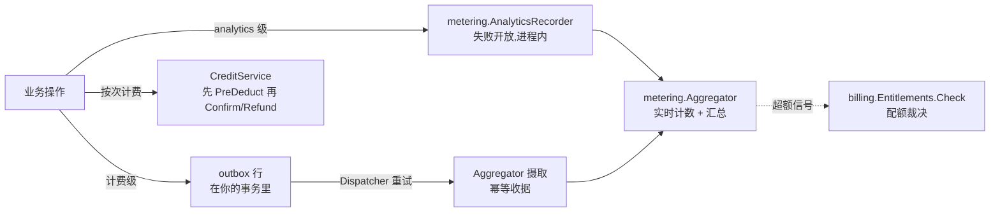

# 计量、计费与合规

这个领域覆盖产品的钱与法定义务:`metering` 记录发生了什么,`billing`
决定租户能做什么并移动信用点,`compliance` 在你自己的数据上执行
保留、擦除与导出的义务。



## Metering:按用途选可靠性级

`metering.Recorder` 有两级,用哪级是「丢一条记录的代价」的商业决策:

- **Analytics 级**(`AnalyticsRecorder`)失败开放:用量记录绝不能让
  业务操作倒下。产品分析用它——什么功能被用了、何时。
- **计费级**(`Enqueue` + `Dispatcher`)不许静默丢弃:outbox 行写在
  *你的*事务里,分发器无限重试,超过既定水平线后把永久失败的行升级
  告警。它的摄取带幂等收据,所以中断后重投不会重复计数。

两级都汇入同一个进程内 `Aggregator`:实时计数器、数据库汇总行、超
额阈值事件。`billing` 模块的配额裁决经 `UsageReader` 接缝读*实时*
计数器——绝不读汇总表,否则聚合延迟会让超配额请求漏过去。

## Billing:权益与信用点账本

- **计划与权益。** 一个 `Plan` 捆绑若干 `Grant`(布尔或配额值的功能
  键),按租户解析——租户自定义计划覆盖同键的平台级计划。业务代码
  在放行操作前问唯一裁决入口 `EntitlementsService.Check`。
- **信用点是先预留后结算的账本。** 对可能失败的按次计费,形态是:
  昂贵调用*之前* `CreditService.PreDeduct`(预留),成功 `Confirm`,
  失败 `Refund`——两者在重试下都幂等,每次变更由一次数据库仲裁的
  UPDATE 保证并发安全。参考应用对它自己的 AI 生成路径跑了完全一样
  的形态,配持久预留存储与对账清扫,崩溃不会搁浅预留。
- **读走 HTTP,写是服务调用。** billing 片段提供两个 GET
  (`/api/v1/billing` 余额与流水)给仪表盘;授信、预留与退款是进程内
  Go 调用,绝不是 HTTP 操作。

## Compliance:保留、擦除与导出

`compliance` 自己没有任何表——它的三个服务通过注册到内核
`Registry.Retention` 席位的参与者操作*你的*数据:

- `RetentionService` 清扫各参与者超过保留窗口的数据。
- `ErasureService` 执行被遗忘权,租户有界:一次擦除绝不触碰别的
  租户的行。
- `ExportService` 收集租户数据的清单,并通过真实的分享链接交付——
  限时、单次查看。

## 最少集成步骤

1. **接模块。** `metering.NewModule(db)` 与 `billing.NewModule(db,
   usage, opts...)` 加入启动模块集——`usage` 是配额检查读取的
   `billing.UsageReader`(真实宿主传自己 metering 模块的
   `Aggregator()`,它结构性满足该接口;只有确定永不会检查配额授
   权时才可传 `nil`);billing 的支付网关注册表与轮询兜底来自宿主
   刻意导入的提供者子包(`go/billing/gateway/...`)。
2. **按正确级别记录。** 分析用:持有一个 `AnalyticsRecorder`,在业务
   路径里调 `Record`。计费用:在与业务写同一事务里 `Enqueue` 用量
   事件,让分发器投递。
3. **门住付费路径。** 在被配额或授权门控的操作前调
   `EntitlementsService.Check`;把拒绝当它本来的编码拒绝处理。
4. **昂贵调用前预留,之后结算。** 用 `PreDeduct` / `Confirm` /
   `Refund` 包住调用,每个操作一个幂等键,并持久化该键,让崩溃不能
   搁浅预留。
5. **注册你的合规参与者。** 拥有带保留策略数据的模块实现
   `RetentionParticipant`,并在 `Register` 时把自己声明到
   `reg.Retention`;清扫、擦除与导出编排随后就会覆盖你的行。

## 完整示例:一次 AI 调用——先授权、再计量、用信用点付费

诊所产品对每次 AI 微笑模拟都同时扣计划权益和信用点。每个请求先过
权益闸门——租户每月 `ai.generations` 配额十次、超额即拒——随后信用
点账本在拨号给 provider 之前先预留本次调用的成本,之后再结算;一次
必须退回的预留正好展示账本如何像死信调用一样吸收失败。下面的演练
在单进程里用内存 SQLite 数据库跑完整条资金路径——和独立部署模式在
生产里跑的形态一致。

前置条件:你的消费模块在 `go.mod` 里用 `replace` 把各 speed 模块指
到本地 checkout(`go mod tidy` 之后即可——各模块自己的
`example_test.go` 正是这样编译的);把代码粘进你自己 `main` 包的文
件里运行。

```go
import (
	"context"
	"fmt"
	"time"

	"gorm.io/gorm"

	"github.com/vislake/speed/go/billing"
	"github.com/vislake/speed/go/dbkit"
	_ "github.com/vislake/speed/go/dbkit/dialect/sqlite" // registers DialectSQLite
	"github.com/vislake/speed/go/metering"
	"github.com/vislake/speed/go/pkgcore"
)

// must keeps the walk readable; a real host returns coded errors instead.
func must(err error) {
	if err != nil {
		panic(err)
	}
}

func entitledMeteredAndCharged() {
	ctx := context.Background()
	// One database, two modules: metering measures, billing decides. The
	// Aggregator satisfies billing.UsageReader structurally (compile-time
	// assertion in go/billing/module.go), so quota checks read the
	// real-time counter, never a summary table.
	db, err := dbkit.Open(ctx, dbkit.Options{Dialect: dbkit.DialectSQLite, DSN: "file:money?mode=memory&cache=shared"})
	must(err)
	usage := metering.NewModule(db)
	money := billing.NewModule(db, usage.Aggregator())
	registry := dbkit.NewMigrationRegistry()
	must(registry.Register(usage))
	must(registry.Register(money))
	must(registry.Apply(ctx, db, dbkit.DialectSQLite))
	usage.Start(ctx) // flush loop + billing dispatcher poll loop
	defer usage.Stop()
	tenantCtx := pkgcore.WithTenant(ctx, "tenant-acme")

	// Sell "pro": 10 AI generations per month, overage blocked.
	plan := &billing.Plan{Key: "pro", Name: "Pro"}
	plan.SetPrice(billing.Money{Cents: 4900, Currency: "USD"})
	plan.Interval = string(billing.BillingIntervalMonth)
	must(plan.SetGrants([]billing.Grant{{
		FeatureKey: "ai.generations", Value: int64(10),
		Period: billing.ResetPeriodMonthly, OverageMode: billing.OverageModeBlock,
	}}))
	must(money.Plans().Create(ctx, plan))
	sub, err := money.Subscriptions().Create(tenantCtx, billing.CreateInput{PlanID: plan.ID})
	must(err)
	_, err = money.Subscriptions().Activate(tenantCtx, sub.ID)
	must(err)
	fmt.Println("subscribed to pro")
	credits := money.Credits()
	_, err = credits.Grant(tenantCtx, billing.GrantInput{Amount: 100, Reason: "promo:welcome"})
	must(err)
	// One AI call = one gate check, one reservation, one usage record, one settlement.
	decision, err := money.Entitlements().Check(tenantCtx, "ai.generations", 1)
	must(err)
	fmt.Printf("check #1 allowed=%v remaining=%d\n", decision.Allowed, *decision.Remaining)

	// Reserve BEFORE the expensive call, one idempotency key per call.
	_, err = credits.PreDeduct(tenantCtx, billing.PreDeductInput{
		Amount: 30, IdempotencyKey: "ai_call:job-1", Reason: "ai_call:job-1",
	})
	must(err)
	fmt.Println("reserved 30 for ai_call:job-1")

	// ...run the call (omitted), then record usage billing-grade in YOUR transaction.
	must(db.Transaction(func(tx *gorm.DB) error {
		_, enqErr := metering.Enqueue(ctx, tx, metering.UsageEvent{
			TenantID:       "tenant-acme",
			Feature:        "ai.generations",
			Quantity:       1,
			IdempotencyKey: "ai_call:job-1-usage",
			OccurredAt:     time.Now(),
		})
		return enqErr
	}))
	_, err = usage.Dispatcher().RunOnce(ctx)
	must(err)
	fmt.Println("usage 1 delivered for ai.generations")

	// Settle: confirm on success — a dead-lettered call refunds instead.
	_, err = credits.Confirm(tenantCtx, "ai_call:job-1")
	must(err)

	// The counter moved, so the next request's headroom shrank.
	decision, err = money.Entitlements().Check(tenantCtx, "ai.generations", 1)
	must(err)
	fmt.Printf("check #2 allowed=%v remaining=%d\n", decision.Allowed, *decision.Remaining)

	// An over-limit request is refused, never admitted-and-billed-later.
	over, err := money.Entitlements().Check(tenantCtx, "ai.generations", 11)
	must(err)
	fmt.Printf("check #3 (11 requested) allowed=%v\n", over.Allowed)

	// The ledger refuses what the balance cannot cover, refunds what a failed call reserved.
	_, err = credits.PreDeduct(tenantCtx, billing.PreDeductInput{
		Amount: 999, IdempotencyKey: "ai_call:job-x", Reason: "ai_call:job-x",
	})
	fmt.Println("refused deduction:", err) // billing.insufficient_credits
	_, err = credits.PreDeduct(tenantCtx, billing.PreDeductInput{
		Amount: 20, IdempotencyKey: "ai_call:job-2", Reason: "ai_call:job-2",
	})
	must(err)
	_, err = credits.Refund(tenantCtx, "ai_call:job-2")
	must(err)
	fmt.Println("refunded reservation ai_call:job-2")

	balance, err := credits.Balance(tenantCtx)
	must(err)
	fmt.Printf("available: %d reserved: %d\n", balance.Available, balance.Reserved)

	rows, err := credits.Transactions(tenantCtx)
	must(err)
	for _, row := range rows {
		fmt.Printf("ledger %s %s %d\n", row.Type, row.Status, row.Amount)
	}
}
```

这段演练演示了三个契约事实:`PreDeduct`/`Confirm`/`Refund` 三件套带
键且幂等——重放一次结算会收敛到第一次调用的行,而不是重复扣两次;
配额裁决经 `UsageReader` 接缝读实时计数器,超额不可能因聚合延迟漏
过去;计费级用量写在*你的*事务里,绝不会像一次性付讫的 analytics
记录那样被静默丢弃(analytics 级是同一条管道:用独立的 feature 键调
`AnalyticsRecorder.Record`——绝不要用计费级路径也在测量的 feature
键——汇入同样的计数器)。合规义务挂在同一次 `Register` 调用上:实
现 `Registry.Retention` 席位要求的参与者形态,你的行就进入保留、擦
除与导出编排——精确的参与者写法见模块页的 `AGENTS.md`。

运行步骤:

1. 在你的消费 `go.mod` 里为 `go/dbkit`、`go/pkgcore`、`go/metering`、
   `go/billing` 加 `replace` 行,然后 `go mod tidy`。
2. 把上面的代码放进你自己 `main` 包的文件,运行 `go run .`。
3. 程序会打开内存 SQLite、从零应用两个模块的版本化迁移然后退出——
   不留任何运行中的东西,也不需要 Docker。

预期输出:

```text
subscribed to pro
check #1 allowed=true remaining=9
reserved 30 for ai_call:job-1
usage 1 delivered for ai.generations
check #2 allowed=true remaining=8
check #3 (11 requested) allowed=false
refused deduction: billing.insufficient_credits
refunded reservation ai_call:job-2
available: 70 reserved: 0
ledger deduct refunded 20
ledger deduct confirmed 30
ledger grant confirmed 100
```

(remaining 数的是*本次请求之后*的余量;账本清单新的在前。)

在参考应用中看到它:

- [go/billing/example_test.go](https://github.com/vislake/speed/blob/main/go/billing/example_test.go)
  与 [go/metering/example_test.go](https://github.com/vislake/speed/blob/main/go/metering/example_test.go)
  ——完全相同的演练,由各模块自己的单元套件编译并执行。
- [examples/reference-app/flowtests/billing_credit_flow_test.go](https://github.com/vislake/speed/blob/main/examples/reference-app/flowtests/billing_credit_flow_test.go)
  ——同样的预留/确认/退款旅程,在参考应用真实组合的 HTTP 栈上跑。

## 下一步

完整 API 见模块参考中的 `metering`、`billing`、`compliance` 页面。

## Source

- [metering AGENTS.md](https://github.com/vislake/speed/blob/main/go/metering/AGENTS.md)
- [billing AGENTS.md](https://github.com/vislake/speed/blob/main/go/billing/AGENTS.md)
- [compliance AGENTS.md](https://github.com/vislake/speed/blob/main/go/compliance/AGENTS.md)
