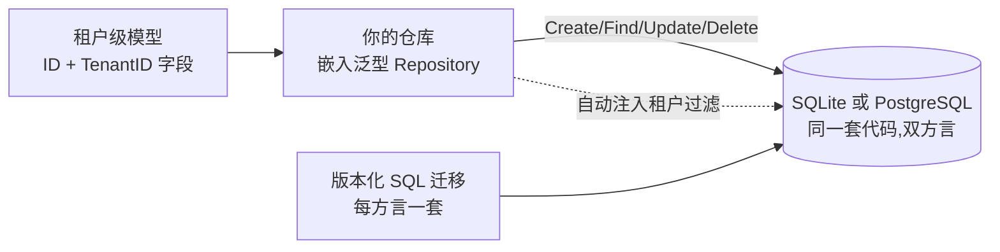

# 数据与配置

这个领域是你产品的持久化地基:你自己的表如何在租户隔离下声明、迁移
与查询(`dbkit`),以及运行时配置与功能开关如何送到产品的每一层
(`config`)。

## dbkit 的形状

每个租户数据模型声明 `ID` 与 `TenantID`(租户在最左主键列),每个
仓库都嵌入 `dbkit.Repository[T]`——你绝不手握裸 `*gorm.DB` 手写
`WHERE tenant_id = ?`。仓库方法从上下文取租户,所以没有租户上下文
的调用者失败关闭,而不是把行漏到别的租户。

## 最少集成步骤

1. **声明模型。** `dbkit.Repository[T]` 要求 `dbkit.TenantScoped`
   标记:`ID` 与 `TenantID` 的字段形态按仓库文档来,每个复合索引
   租户在最前。
2. **嵌入仓库。** 你的仓库类型嵌入 `dbkit.Repository[YourModel]`;
   通用基座提供租户过滤的增删改查,以及多语句写所需的
   `dbkit.WithTenantSession` 事务形态。
3. **版本化 SQL 迁移,绝不 `AutoMigrate`。** 每个模块随附双方言
   迁移集(SQLite 与 PostgreSQL),由 `dbkit.MigrationRegistry` 应用;
   模块经 `pkgcore.Module` 的 `Migrations()` 暴露它们。两种方言一视
   同仁——避开 PostgreSQL 专属特性(`gen_random_uuid()`、原生数组、
   `NOW()`);ID 在应用里生成。
4. **设计前先给表分类。** 租户数据是租户级、跑
   `tenancytest.AssertIsolated`;身份数据(可能属于多个租户的人)与
   平台数据(全局共享、租户只读)绝不实现 `TenantScoped`,改跑
   `AssertNotTenantScoped`。
5. **既要敏感又要可查的字段加盲索引。** 既是敏感信息又是查找键的
   字段(比如用作登录标识的手机号)既要加密存储,也要经
   `dbkit.NewBlindIndexer` 加盲索引——对规范化形式的 HMAC——绝不
   明文查询。

## config 的形状

`config` 把值与功能开关送到 speed 产品的每一层:面向租户的品牌与
支持设置、能力开关、AI 密钥。两个决策塑造了它的用法:

- **Register 与 Attach 分离。** 模块在 `Register` 时*声明*自己的配置
  项与开关;`Attach`——恰好一次,在 `Kernel.Bootstrap` 返回之后——
  把所有模块的声明折成一个 schema,并且只要存在 `Sensitive` 项就
  拒绝无密钥启动。宿主保留 Attach 返回的 `*Service`。
- **作用域层级与回退。** 每个值只在一个层级(租户/系统);读取从窄
  到宽回退:租户行、系统行、schema 默认值。无租户上下文绝不看到
  租户行。

读取走 `Service.Get`(类型化变体 `GetTyped[string]`、
`GetTyped[bool]`……)。写入归属到上下文租户;系统级写入需要带审计的
系统上下文。敏感值用你的 `dbkit.Cipher` 封存,并在一切可能泄漏的
边界打上 `[redacted]`——事件、日志、Watch 投递。

两个预认证端点——`/api/config/public`(仅 Public 项)与
`/api/system/features`(解析后的启用开关列表)——服务登录页与前端
渠道可见性。用导出的 `PathPublic` 与 `PathSystemFeatures` 常量把它
们加进你租户中间件的白名单。

## 值得知道的边界

- 配置按设计是动态的:一次写入发布 `config.item.changed`,每个进程
  既按事件失效缓存,也轮询兜底防丢。写入生效瞬间跨副本并非快照
  一致——设计能容忍配置最终收敛的页面。
- `configs` 表是平台数据,属刻意的例外:系统层必须对每个租户的回退
  查找可见。别把例外复制给租户数据。

## 下一步

完整 API 在模块参考的 `dbkit` 与 `config` 页面;仓库怎么拿到租户见
多租户与组织领域页。

## Source

- [dbkit AGENTS.md](https://github.com/vislake/speed/blob/main/go/dbkit/AGENTS.md)
- [config AGENTS.md](https://github.com/vislake/speed/blob/main/go/config/AGENTS.md)
- [tenancy AGENTS.md](https://github.com/vislake/speed/blob/main/go/tenancy/AGENTS.md)
