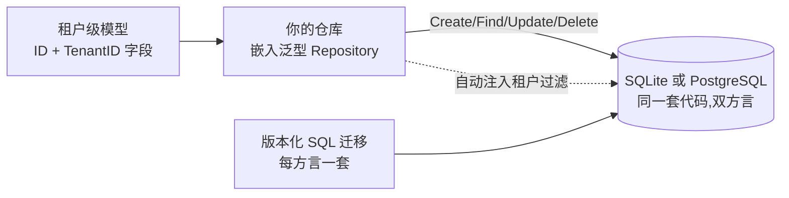

# 数据与配置

这个领域是你产品的持久化地基:你自己的表如何在租户隔离下声明、迁移
与查询(`dbkit`),以及运行时配置与功能开关如何送到产品的每一层
(`config`)。

## dbkit 的形状



每个租户数据模型声明 `ID` 与 `TenantID`(租户在最左主键列),每个
仓库都嵌入 `dbkit.Repository[T]`——你绝不手握裸 `*gorm.DB` 手写
`WHERE tenant_id = ?`。仓库方法从上下文取租户,所以没有租户上下文
的调用者失败关闭,而不是把行漏到别的租户。

## 最少集成步骤

1. **声明模型。** `dbkit.Repository[T]` 要求 `dbkit.TenantScoped`
   标记:`ID` 与 `TenantID` 的字段形态按仓库文档来,每个复合索引
   租户在最前。
2. **嵌入仓库。** 你的仓库类型嵌入 `dbkit.Repository[YourModel]`;
   通用基座提供租户过滤的增删改查,以及多语句写所需的
   `dbkit.WithTenantSession` 事务形态。
3. **版本化 SQL 迁移,绝不 `AutoMigrate`。** 每个模块随附双方言
   迁移集(SQLite 与 PostgreSQL),由 `dbkit.MigrationRegistry` 应用;
   模块经 `the module contract` 的 `Migrations()` 暴露它们。两种方言一视
   同仁——避开 PostgreSQL 专属特性(`gen_random_uuid()`、原生数组、
   `NOW()`);ID 在应用里生成。
4. **设计前先给表分类。** 租户数据是租户级、跑
   `tenancytest.AssertIsolated`;身份数据(可能属于多个租户的人)与
   平台数据(全局共享、租户只读)绝不实现 `TenantScoped`,改跑
   `AssertNotTenantScoped`。
5. **既要敏感又要可查的字段加盲索引。** 既是敏感信息又是查找键的
   字段(比如用作登录标识的手机号)既要加密存储,也要经
   `dbkit.NewBlindIndexer` 加盲索引——对规范化形式的 HMAC——绝不
   明文查询。

## config 的形状

`config` 把值与功能开关送到 speed 产品的每一层:面向租户的品牌与
支持设置、能力开关、AI 密钥。两个决策塑造了它的用法:

- **Register 与 Attach 分离。** 模块在 `Register` 时*声明*自己的配置
  项与开关;`Attach`——恰好一次,在 `the assembly` 返回之后——
  把所有模块的声明折成一个 schema,并且只要存在 `Sensitive` 项就
  拒绝无密钥启动。宿主保留 Attach 返回的 `*Service`。
- **作用域层级与回退。** 每个值只在一个层级(租户/系统);读取从窄
  到宽回退:租户行、系统行、schema 默认值。无租户上下文绝不看到
  租户行。

读取走 `Service.Get`(类型化变体 `GetTyped[string]`、
`GetTyped[bool]`……)。写入归属到上下文租户;系统级写入需要带审计的
系统上下文。敏感值用你的 `dbkit.Cipher` 封存,并在一切可能泄漏的
边界打上 `[redacted]`——事件、日志、Watch 投递。

两个预认证端点——`/api/v1/config/public`(仅 Public 项)与
`/api/v1/config/features`(解析后的启用开关列表)——服务登录页与前端
渠道可见性。用导出的 `PathPublic` 与 `PathSystemFeatures` 常量把它
们加进你租户中间件的白名单。

## 值得知道的边界

- 配置按设计是动态的:一次写入发布 `config.item.changed`,每个进程
  既按事件失效缓存,也轮询兜底防丢。写入生效瞬间跨副本并非快照
  一致——设计能容忍配置最终收敛的页面。
- `configs` 表是平台数据,属刻意的例外:系统层必须对每个租户的回退
  查找可见。别把例外复制给租户数据。

## 下一步

完整 API 在模块参考的 `dbkit` 与 `config` 页面;仓库怎么拿到租户见
多租户与组织领域页。

## 完整示例:一张租户级订阅表与运行时设置

本节让同一个业务模块把本页的两半各演一遍。`subscriptions` 表声明成
租户级模型,由 `dbkit.Repository[T]` 驱动——没有租户上下文的写失败
关闭。同一个模块在注册时声明 `support.email`(公开的 string 配置项)
与 `support.live_chat`(功能开关);`config` 的 `Attach` 冻结 schema
之后,读取按窄到宽回退:schema 默认值一直生效,直到某租户的租户级
写入只为自己覆盖它。整个示例自足(内存 SQLite、单连接),所用符号全
部来自 `go/dbkit` 与 `go/config` 的真实 API(与它们自带示例套件运行
的是同一批调用)。

```go
package main

import (
	"context"
	"embed"
	"fmt"

	"github.com/vislake/speed/go/config"
	"github.com/vislake/speed/go/dbkit"
	_ "github.com/vislake/speed/go/dbkit/dialect/sqlite" // 注册 DialectSQLite
	"github.com/vislake/speed/go/pkgcore"
)

// subscription 是租户级模型:按约定导出名为 ID 与 TenantID 的字符串
// 字段,tenant_id 是最左主键列。
type subscription struct {
	ID       string `gorm:"primaryKey;size:26"`
	TenantID string `gorm:"primaryKey;size:26;not null"`
	PlanID   string `gorm:"size:64;not null"`
	Status   string `gorm:"size:32;not null"`
}

func (s subscription) GetTenantID() pkgcore.TenantID { return pkgcore.TenantID(s.TenantID) }
func (subscription) TableName() string               { return "subscriptions" }

// subscriptionsModule 在 Register 时声明模块自己的配置项与功能开关;
// config 模块把它们折进同一个 schema。
type subscriptionsModule struct{}

func (subscriptionsModule) Name() string         { return "subscriptions" }
func (subscriptionsModule) DependsOn() []string  { return nil }
func (subscriptionsModule) Migrations() embed.FS { return embed.FS{} }
func (subscriptionsModule) Locales() embed.FS    { return embed.FS{} }
func (subscriptionsModule) OpenAPISpec() []byte  { return nil }
func (subscriptionsModule) Register(reg *pkgcore.ComponentRegistry) error {
	if err := reg.ConfigSeat().Add(pkgcore.ConfigItem{
		Key: "support.email", Type: "string", Default: "support@example.com",
		Public: true, Description: "The address shown to this tenant's users",
		Group:  "support",
	}); err != nil {
		return err
	}
	return reg.FeaturesSeat().Add(pkgcore.FeatureFlag{
		Key: "support.live_chat", Default: false,
		Description: "Whether the tenant gets the live-chat widget",
	})
}

func main() {
	ctx := context.Background()

	db, err := dbkit.Open(ctx, dbkit.Options{Dialect: dbkit.DialectSQLite, DSN: "file:data_config_example?mode=memory&cache=shared"})
	if err != nil {
		panic(err)
	}

	// 只走版本化 SQL——绝不 AutoMigrate。真实模块自带双方言迁移文件;
	// 这里用裸 CREATE TABLE 顶替它们。
	if err = db.Exec(`CREATE TABLE subscriptions (
		id        VARCHAR(26)  NOT NULL,
		tenant_id VARCHAR(26)  NOT NULL,
		plan_id   VARCHAR(64)  NOT NULL,
		status    VARCHAR(32)  NOT NULL,
		PRIMARY KEY (tenant_id, id)
	)`).Error; err != nil {
		panic(err)
	}

	// config 模块拥有 configs 表,所以 Attach 读写任何东西之前必须先
	// 应用它的迁移。
	configModule := config.NewModule(db, config.WithPollInterval(0))
	migrations := dbkit.NewMigrationRegistry()
	if err = migrations.Register(configModule); err != nil {
		panic(err)
	}
	if err = migrations.Apply(ctx, db, dbkit.DialectSQLite); err != nil {
		panic(err)
	}

	// 装配遍历模块图,逐个执行各阶段;Register 在 Init 阶段运行;Attach——恰好一次,在其
	// 之后——冻结所有声明的并集。
	reg := pkgcore.NewComponentRegistry()
if err := app.Assemble(ctx, reg, app.LoadSpec{Host: &hostConfig, Options: loaderOpts}); err != nil { /* handle err */ }
	if err != nil {
		panic(err)
	}
	svc, err := configModule.Attach(reg)
	if err != nil {
		panic(err)
	}
	defer func() { _ = svc.Close() }()

	// 仓库半场:租户来自上下文,绝不来自参数——没有租户上下文的调用
	// 者在碰到数据库之前就失败关闭。
	repo := dbkit.NewRepository[subscription](db)
	acmeCtx := pkgcore.WithTenant(ctx, "tenant-acme")
	sub := &subscription{ID: "01ARZ3NDEKTSV4RRFFQ69G5FAV", PlanID: "plan_pro", Status: "active"}
	if err = repo.Create(acmeCtx, sub); err != nil {
		panic(err)
	}
	got, err := repo.FindByID(acmeCtx, sub.ID)
	if err != nil {
		panic(err)
	}
	fmt.Println("subscription:", got.PlanID, got.Status)

	if err = repo.Create(ctx, sub); err != nil {
		fmt.Println("create without tenant:", err)
	}

	// 配置半场:什么都没写时,每个租户读到的都是 schema 默认值;读取
	// 按窄到宽回退(租户行、系统行、默认值)。
	email, err := config.GetTyped[string](svc, ctx, "support.email")
	if err != nil {
		panic(err)
	}
	fmt.Println("default:", email)

	if err = svc.Set(acmeCtx, config.ScopeTenant, "support.email",
		config.Value{Data: "help@acme.example"}, "alice"); err != nil {
		panic(err)
	}
	acmeEmail, err := config.GetTyped[string](svc, acmeCtx, "support.email")
	if err != nil {
		panic(err)
	}
	fmt.Println("tenant-acme:", acmeEmail)

	globexEmail, err := config.GetTyped[string](svc, pkgcore.WithTenant(ctx, "tenant-globex"), "support.email")
	if err != nil {
		panic(err)
	}
	fmt.Println("tenant-globex:", globexEmail)

	enabled, err := svc.IsEnabled(acmeCtx, "support.live_chat")
	if err != nil {
		panic(err)
	}
	fmt.Println("live_chat:", enabled)
}
```

**每段程序在做什么。** 仓库方法从上下文取租户——`pkgcore.WithTenant`
顶替真实请求里 `tenancy.Middleware` 注入的那一步——所以无上下文的
`Create` 在碰到数据库之前就失败。配置这边,`Register` 只声明;
`Attach` 才是冻结 schema 并返回宿主保留的 `*Service` 的一步。
`svc.Set` 写在一个作用域层级上(这里是 `config.ScopeTenant`;
`ScopeSystem` 写需要带审计的系统上下文),写入会发布
`config.item.changed`,每个进程都监听它——`WithPollInterval(0)` 关掉
的轮询器是防丢兜底。

**怎么跑。** 在本仓库的 checkout 旁建一个临时模块,把上面的文件放
进去,用 `replace` 行把 import 指向 checkout——程序 import 的每个模块
一行,例如 `replace github.com/vislake/speed/go/dbkit => /path/to/checkout/go/dbkit`——
然后以 `GOWORK=off` 运行 `go mod tidy` 与 `go run .`(别让 checkout
自己的 `go.work` 渗进构建)。tidy 会拉取一次第三方依赖。

**预期结果。** 程序在 stdout 打印下面六行;内核自己的接缝组合日志行
先打到 stderr:

```
subscription: plan_pro active
create without tenant: pkgcore: no tenant in context; tenant-scoped access requires a context built with WithTenant
default: support@example.com
tenant-acme: help@acme.example
tenant-globex: support@example.com
live_chat: false
```

行在 `tenant-acme` 下写入并读回;同一条 `Create` 在无租户上下文时,
任何 SQL 执行前就被 `pkgcore.ErrNoTenant` 的原样文本拒绝。配置读取
展示回退层级如何生效:schema 默认值处处生效,直到 `tenant-acme`
把 `support.email` 覆盖成自己的值——此后第二个租户
(`tenant-globex`)读到的仍是默认值。功能开关解析到声明的 `false`
默认值。

**在参考应用中看到它。** 参考应用的 notes 模块就是真实代码里的同一
形态:[`internal/notes/repository.go`](https://github.com/vislake/speed/blob/main/examples/reference-app/internal/notes/repository.go)
嵌入 `dbkit.Repository[Note]`,绝不手握裸 `*gorm.DB`;
[`internal/notes/module.go`](https://github.com/vislake/speed/blob/main/examples/reference-app/internal/notes/module.go)
在 `Register` 里用 `reg.ConfigSeat().Add` / `reg.FeaturesSeat().Add` 声明它的配置项
与功能开关——正是参考应用 `internal/app/server.go` 随后折进
`configModule.Attach` 冻结的 schema 的那些声明。

## Source

- [dbkit AGENTS.md](https://github.com/vislake/speed/blob/main/go/dbkit/AGENTS.md)
- [config AGENTS.md](https://github.com/vislake/speed/blob/main/go/config/AGENTS.md)
- [tenancy AGENTS.md](https://github.com/vislake/speed/blob/main/go/tenancy/AGENTS.md)
