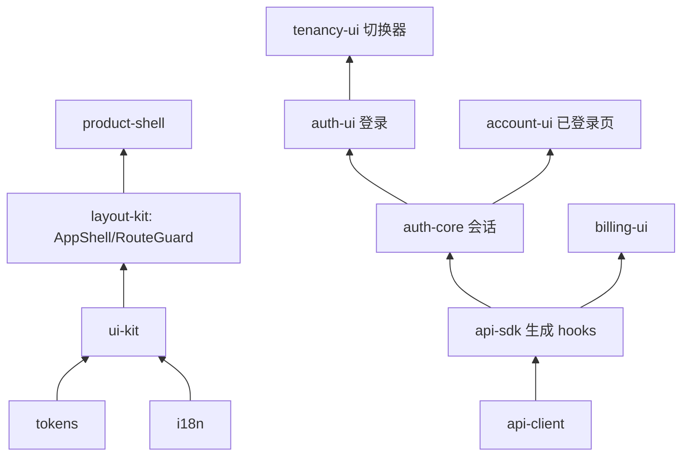

# 搭建前端

speed 的前端一半是十二个 `@speed/*` npm 包,组合进你自己的应用
shell。包刻意分层:设计与 i18n 的基础在底,唯一的 HTTP 客户端在
中,会话与登录家族在上,组装 shell 在顶。没有一个包自己取数或存数
——每次交互都经回调或会话操作上报,HTTP 只发生在一处。

## 分层

- **设计与文本**——`@speed/tokens` 是零依赖的设计 token 树;
  `@speed/i18n` 包装 react-i18next,与后端目录同一套"无回退"纪律
  (缺键渲染键本身,绝不渲染另一种语言的文本);`@speed/ui-kit` 把
  token 映射成 MUI v9 主题并交付七个受控组件。
- **唯一 HTTP 客户端**——`@speed/api-client` 是手写 HTTP 的唯一之
  家:可注入的 `fetch`、纯内存 token 存储、单飞 401 刷新、保守的瞬态
  重试、每个失败归一成一个携带 API 信封 `code` 的 `ApiError`。别的
  包不自己发 HTTP。
- **生成面**——`@speed/api-sdk` 是合并 API 文档的生成类型化客户端,
  通过一个手写接缝(`bindRequestFn`)绑到你的客户端上,react-query
  hooks 跑在共享 QueryClient 上。
- **会话与身份**——`@speed/auth-core` 是无头会话状态机(访问令牌在
  store,刷新令牌只在会话闭包);`auth-ui` 渲染登录家族;`account-ui`
  渲染已登录账户页;`tenancy-ui` 渲染租户切换器。
- **外框与组装**——`layout-kit` 提供 `AppShell` 与 `RouteGuard`
  (与认证无关);`product-shell` 组合完整的三分支视图机(登出 → 登
  录面,已登录 → 外框,会话死亡 → 会话结束);`billing-ui` 渲染计费
  只读面。

## 组合步骤

1. **一次构建你的客户端。** `createClient(fetch, ...)` 接好传输、
   token 存储与静默刷新腿(`refreshAccessToken: () => session.refresh()`);
   再把它绑进 SDK:`bindRequestFn(client.request)`。
2. **挂上会话。** 在生成的 authn 操作上 `createAuthSession(store)`;
   `attachSession(session)` 喂 hooks。权限检查是宿主挂的列表
   (`setPermissionSet('tenant' | 'system', codes)`),包代码从不取。
3. **注册语言包。** 每个包带自己的双语资源(`ui-kit`、`auth-ui`、
   `tenancy-ui`、`account-ui`、`product-shell`、`billing-ui` 命名空
   间,外加你自己的应用包);`registerNamespace` 用前校验键集一致。
   用 `AppThemeProvider` 与 `QueryClientProvider` 包住组件树。
4. **给路由设门。** `RouteGuard` 收宿主计算的状态(`allowed` /
   `denied` / `pending`)——从权限取回或服务端应答的查询推导(被拒的
   读失败关闭到 denied)。用 `ProductShell`(或你自己在 `AppShell`
   上的 shell)作外框。

## 下一步

- 十二个 `@speed/*` 包的完整逐包页面(选项、示例)将落在本栏的模块
  参考区。
