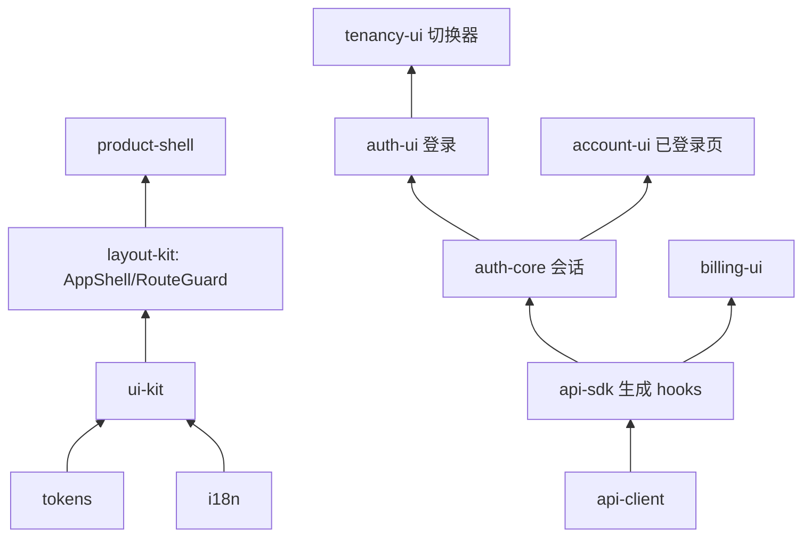

# 搭建前端

speed 的前端一半是十二个 `@speed/*` npm 包,组合进你自己的应用
shell。包刻意分层:设计与 i18n 的基础在底,唯一的 HTTP 客户端在
中,会话与登录家族在上,组装 shell 在顶。没有一个包自己取数或存数
——每次交互都经回调或会话操作上报,HTTP 只发生在一处。



## 分层

- **设计与文本**——`@speed/tokens` 是零依赖的设计 token 树;
  `@speed/i18n` 包装 react-i18next,与后端目录同一套"无回退"纪律
  (缺键渲染键本身,绝不渲染另一种语言的文本);`@speed/ui-kit` 把
  token 映射成 MUI v9 主题并交付七个受控组件。
- **唯一 HTTP 客户端**——`@speed/api-client` 是手写 HTTP 的唯一之
  家:可注入的 `fetch`、纯内存 token 存储、单飞 401 刷新、保守的瞬态
  重试、每个失败归一成一个携带 API 信封 `code` 的 `ApiError`。别的
  包不自己发 HTTP。
- **生成面**——`@speed/api-sdk` 是合并 API 文档的生成类型化客户端,
  通过一个手写接缝(`bindRequestFn`)绑到你的客户端上,react-query
  hooks 跑在共享 QueryClient 上。
- **会话与身份**——`@speed/auth-core` 是无头会话状态机(访问令牌在
  store,刷新令牌只在会话闭包);`auth-ui` 渲染登录家族;`account-ui`
  渲染已登录账户页;`tenancy-ui` 渲染租户切换器。
- **外框与组装**——`layout-kit` 提供 `AppShell` 与 `RouteGuard`
  (与认证无关);`product-shell` 组合完整的三分支视图机(登出 → 登
  录面,已登录 → 外框,会话死亡 → 会话结束);`billing-ui` 渲染计费
  只读面。

## 组合步骤

1. **一次构建你的客户端。** `createClient(fetch, ...)` 接好传输、
   token 存储与静默刷新腿(`refreshAccessToken: () => session.refresh()`);
   再把它绑进 SDK:`bindRequestFn(client.request)`。
2. **挂上会话。** 在生成的 authn 操作上 `createAuthSession(store)`;
   `attachSession(session)` 喂 hooks。权限检查是宿主挂的列表
   (`setPermissionSet('tenant' | 'system', codes)`),包代码从不取。
3. **注册语言包。** 每个包带自己的双语资源(`ui-kit`、`auth-ui`、
   `tenancy-ui`、`account-ui`、`product-shell`、`billing-ui` 命名空
   间,外加你自己的应用包);`registerNamespace` 用前校验键集一致。
   用 `AppThemeProvider` 与 `QueryClientProvider` 包住组件树。
4. **给路由设门。** `RouteGuard` 收宿主计算的状态(`allowed` /
   `denied` / `pending`)——从权限取回或服务端应答的查询推导(被拒的
   读失败关闭到 denied)。用 `ProductShell`(或你自己在 `AppShell`
   上的 shell)作外框。

## 下一步

- 十二个 `@speed/*` 包的完整逐包页面(选项、示例)将落在本栏的模块
  参考区。

## 完整示例:组装一个"先登录"的应用外壳

假设你在给自己交付的产品做 web 端——按参考应用的形状,一个诊所
员工工具——想在业务界面长出来之前先把整套前端组合放到一处。下面
三个文件就是一个完整的最小外壳:你自己命名空间下的双语资源包、一
个把 i18n、会话与唯一 HTTP 客户端接好的 bootstrap,以及架在
`ProductShell` 上的视图机——匿名时显示登录面,登录后显示
`AppShell` 外框(导航、租户切换、登出)。里面每个名字都是一个真实
`@speed` 包的导出——参考应用 `src/main.tsx` 跑的就是同一套组合。

```ts
// resources.ts -- your app's own message bundle. The two JSON files
// must carry identical key sets (registerNamespace refuses a mismatch).
import type { ResourceBundle } from '@speed/i18n'
import enUS from './locales/en-US.json' with { type: 'json' }
import zhCN from './locales/zh-CN.json' with { type: 'json' }

export const APP_NAMESPACE = 'clinic-app' as const

export const appResources: Readonly<Record<string, ResourceBundle>> = {
  'en-US': enUS as ResourceBundle,
  'zh-CN': zhCN as ResourceBundle,
}
```

```tsx
// main.tsx -- one composition per page load: i18n, the session, the
// client, then the providers, in the order the packages expect.
import { StrictMode } from 'react'
import { createRoot } from 'react-dom/client'
import { QueryClient, QueryClientProvider } from '@tanstack/react-query'
import { createClient, createMemoryAccessTokenStore } from '@speed/api-client'
import { bindRequestFn } from '@speed/api-sdk/runtime'
import { attachSession, createAuthSession } from '@speed/auth-core'
import { createI18n, I18nextProvider, registerNamespace } from '@speed/i18n'
import { AppThemeProvider, UI_KIT_NAMESPACE, uiKitResources } from '@speed/ui-kit'
import { LAYOUT_KIT_NAMESPACE, layoutKitResources } from '@speed/layout-kit'
import { AUTH_UI_NAMESPACE, authUiResources } from '@speed/auth-ui'
import { TENANCY_UI_NAMESPACE, tenancyUiResources } from '@speed/tenancy-ui'
import { PRODUCT_SHELL_NAMESPACE, productShellResources } from '@speed/product-shell'
import { App } from './app.js'
import { APP_NAMESPACE, appResources } from './resources.js'

const container = document.getElementById('root')
if (container === null) {
  throw new Error('index.html must mount the app into #root')
}

// 1. i18n, negotiated per visitor; every namespace a rendered unit
//    reads is registered exactly once.
const i18n = createI18n({
  supportedLanguages: ['zh-CN', 'en-US'],
  defaultLanguage: 'zh-CN',
})
registerNamespace(i18n, UI_KIT_NAMESPACE, uiKitResources)
registerNamespace(i18n, LAYOUT_KIT_NAMESPACE, layoutKitResources)
registerNamespace(i18n, AUTH_UI_NAMESPACE, authUiResources)
registerNamespace(i18n, TENANCY_UI_NAMESPACE, tenancyUiResources)
registerNamespace(i18n, PRODUCT_SHELL_NAMESPACE, productShellResources)
registerNamespace(i18n, APP_NAMESPACE, appResources)

// 2. The memory-only session over the generated authn operations; the
//    hooks read it after attachSession, and a reload starts anonymous.
const accessTokenStore = createMemoryAccessTokenStore()
const session = createAuthSession(accessTokenStore)
attachSession(session)

// 3. The app's one HTTP client, bound into the generated SDK's seam.
bindRequestFn(
  createClient({
    baseUrl: window.location.origin,
    accessTokenStore,
    refreshAccessToken: () => session.refresh(),
  }),
)

// 4. The providers; a session end also empties the shared query cache.
const queryClient = new QueryClient()

createRoot(container).render(
  <StrictMode>
    <I18nextProvider i18n={i18n}>
      <AppThemeProvider i18n={i18n}>
        <QueryClientProvider client={queryClient}>
          <App session={session} />
        </QueryClientProvider>
      </AppThemeProvider>
    </I18nextProvider>
  </StrictMode>,
)
```

```tsx
// app.tsx -- the three-branch view machine: sign-in while anonymous,
// the frame once authenticated, session-ended when a session dies
// mid-use. All views are host content.
import { Typography } from '@mui/material'
import type { ReactElement } from 'react'
import type { AuthSession } from '@speed/auth-core'
import { useCurrentTenant } from '@speed/auth-core'
import { useTranslation } from '@speed/i18n'
import type { AppShellNavItem } from '@speed/layout-kit'
import { SignInScreen, SignOutButton } from '@speed/auth-ui'
import { TenantSwitcher } from '@speed/tenancy-ui'
import { ProductShell } from '@speed/product-shell'
import { APP_NAMESPACE } from './resources.js'

export function App({ session }: { session: AuthSession }): ReactElement {
  const { t } = useTranslation(APP_NAMESPACE)
  const currentTenant = useCurrentTenant()

  // Host-computed nav: items carry their own `selected`; the shell
  // never path-matches. Labels come from your bundle.
  const navItems: readonly AppShellNavItem[] = [
    { id: 'notes', label: t('nav.notes'), href: '#/notes', selected: true },
    { id: 'account', label: t('nav.account'), href: '#/account', selected: false },
  ]

  const tenants = [
    { id: 'tenant-acme', name: t('tenants.acme') },
    { id: 'tenant-globex', name: t('tenants.globex') },
  ]

  return (
    <ProductShell
      navItems={navItems}
      header={t('brand')}
      userMenu={
        <>
          <TenantSwitcher
            session={session}
            tenants={tenants}
            currentTenantId={currentTenant?.tenantId ?? null}
          />
          <SignOutButton session={session} />
        </>
      }
      signIn={<SignInScreen session={session} channels={['password']} />}
    >
      {/* Surface content in the frame's main landmark: reads go through
          your app-owned SDK's generated react-query hooks; a refused
          read (403) feeds a route gate's status. */}
      <Typography variant="h6">{t('notes.heading')}</Typography>
    </ProductShell>
  )
}
```

`src/locales` 下的两个 JSON 文件装着片段用到的键——`brand`、
`nav.notes`、`nav.account`、`notes.heading`、`tenants.acme`、
`tenants.globex`——两种语言键集完全一致,只有值不同。两个租户 id
与参考应用的 demo 花名册一致,同一份宿主数据对它可以原样使用。

**跑起来。** 在仓库里,最顺的位置是 `web/` pnpm workspace 的一个外部
成员,正如 `examples/reference-app/web` 那样(`web/pnpm-workspace.yaml`
列出该路径;共享一份冻结 lockfile)。已发布的消费者则从 registry 以
锁步版本安装同一批包,`react`、`react-dom`、`@mui/material` 与
`@tanstack/react-query` 作为 peer 依赖(参考应用的 `package.json` 就
是精确的依赖清单)。然后:

1. 用 vite 的 React + TypeScript 模板建项目,`index.html` 带
   `<div id="root">`,按上面的清单加依赖。
2. 拷入上面三个文件与两个 locale JSON。
3. 起好你的会话要对话的后端(仓库内:参考应用服务器,带
   `APP_DEMO_USERS_PASSWORD` 启动,`demo-owner@example.com` 会被种进
   两个 demo 租户),再在 web 主机里 `pnpm dev`——参考应用的 vite
   配置把 `/api` 调用代理到后端默认端口。打开 dev server 地址。

**你会看到什么。** 首屏渲染登录面(按片段声明,只有密码通道);登录
应答来自你的后端——绑定客户端背后的 authn 操作——绝不是包代码。
以种好的 demo 负责人账号登录,应答的 principal 落在
`tenant-acme`,于是外框出现:两个导航项、租户切换器(当前租户那一
行禁用)与登出按钮;切到 `tenant-globex` 经绑定客户端发起一次会话
切换。服务端会话死亡——一次被服务端拒绝的刷新——把页面收敛到会话
结束屏,它的动作把人送回登录面。

**在参考应用里看到它**——同一形状的真实、更大的组合:
[`examples/reference-app/web/src/main.tsx`](https://github.com/vislake/speed/blob/main/examples/reference-app/web/src/main.tsx)
(bootstrap)与
[`examples/reference-app/web/src/app.tsx`](https://github.com/vislake/speed/blob/main/examples/reference-app/web/src/app.tsx)
(`ProductShell` 外框 + 宿主 chrome 与 hash 路由界面)。

一个关键点:三个文件里没有任何东西自己发 HTTP、读写存储或导航——
会话与绑定客户端是仅有的活动件,这正是同一套组合能承载你之后加的
任何界面的原因。
