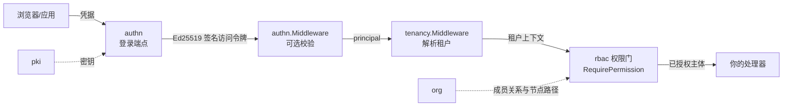

# 身份与访问

这个领域回答:你的用户是谁、他们怎么登录、能做什么。`authn` 模块
负责认证(密码、会话、MFA、社交与企业登录),`rbac` 负责授权(默认
拒绝,精确的 `resource:action` 授权),`org` 提供让授权有边界的组织
树与成员关系。`pki` 垫在下面,是 authn 访问令牌签发与验证的签名
密钥源。



中间件顺序是关键结构,由真实测试钉死:先 `authn.Middleware`
(有令牌就校验——坏令牌 401,无令牌保持匿名,绝不臆测租户),下一层
`tenancy.Middleware(authn.NewPrincipalResolver())` 把验证过的
principal 变成每个租户级仓库都需要的租户上下文。你的路由绝不能挂
在会猜租户的中间件下游,租户也绝不来自请求头。

## 最少集成步骤

1. **把模块接进你的内核。** 在 `Kernel.Bootstrap` 的模块集里加入
   `authn`、`rbac`、`org`(以及作为 authn 密钥源的 `pki`)。
   `dbkit.MigrationRegistry` 会应用每个模块自己的迁移;参考应用
   `examples/reference-app/internal/app/server.go` 的启动注释逐行演示
   了确切接线顺序。
2. **给 authn 必选的接缝。** `authn.NewModule` 急切校验选项:`KeySource`
   (pki 的 `Service` 满足它)与盲索引密钥都是必填——两者都没有安全
   默认值;`MembershipReader` 在登录时回答「该用户是否是该租户成员」
   ——缺省即拒绝,绝不放行。
3. **按序挂中间件链。** authn 自己的子树直接从 `authn.Middleware`
   的输出挂出——绝不经过 `tenancy.Middleware`,因为登录发生在任何
   租户存在之前。其余一切路由用下游的
   `tenancy.Middleware(authn.NewPrincipalResolver())` 保护。
4. **用权限门护住路由。** rbac 在 `Kernel.Bootstrap` 之后执行
   `Attach`(冻结所有模块声明的权限词汇表——授予词汇表外的任何东西
   都会被拒绝)。用 `rbac.RequirePermission("notes", "write")` 或其
   `*Func` 变体护住操作;org 导出它自己四条路由声明的权限
   (`PermissionRead`、`PermissionManage`、`PermissionInviteMember`、
   `PermissionRemoveMember`)供你同样使用。
5. **让身份数据走 org 的流程。** 注册用户后,通过 `org` 的邀请流把
   他们请进一个租户节点;被接受的成员关系就是你的
   `MembershipReader` 与 rbac 主题解析看到的东西。

## 值得知道的边界

- 访问令牌短时有效、Ed25519 签名;刷新令牌单次使用,重放会使整族
  令牌轮换并吊销会话——客户端必须串行化刷新。
- 社交/企业登录按受信提供者的已验证邮箱绑定,绝不只凭邮箱同名合并;
  最后登录方式约束让纯社交账号无法甩掉自己的渠道。
- 所有暴露存在性的应答(用户存在、邮箱被占、提供者已绑)都被抑制:
  枚举什么也学不到。
- 登录、注册与 step-up 都在滑窗限流与渐进锁定的后面;step-up 验证
  恰好活过一个访问令牌。

## 下一步

每个模块的完整 API 面——选项、处理器、错误码——在模块参考的
`authn`、`rbac`、`org`、`pki` 各自页面。本领域应答的错误码在
[错误码索引](../../error-codes/)。

## 完整示例:密码登录与只读权限门

本节把本页顶部示意图里的整条链接进一个可运行的程序。一个用户注册并
用密码登录:`authn` 在真实 `pki` 模块掌管的密钥上签发 Ed25519 访问
令牌;notes 处理器挂在 `tenancy.Middleware` 与 `rbac` 权限门后面——
持有 `note-reader` 角色的成员能列笔记,却写不了笔记。整个示例自足
(内存 SQLite、进程内接缝),所用符号全部来自模块的真实 API(与它们
各自示例套件运行的是同一形态的接线)。

```go
package main

import (
	"context"
	"embed"
	"fmt"
	"net/http"
	"net/http/httptest"
	"strings"

	"github.com/vislake/speed/go/authn"
	"github.com/vislake/speed/go/dbkit"
	_ "github.com/vislake/speed/go/dbkit/dialect/sqlite" // 注册 DialectSQLite
	"github.com/vislake/speed/go/pkgcore"
	"github.com/vislake/speed/go/pki"
	"github.com/vislake/speed/go/rbac"
	"github.com/vislake/speed/go/tenancy"
)

// notesLikeModule 声明「notes」这个业务面自己的权限词汇——rbac.Attach
// 冻结、授权只能引用这些条目。
type notesLikeModule struct{}

func (notesLikeModule) Name() string         { return "notes" }
func (notesLikeModule) DependsOn() []string  { return nil }
func (notesLikeModule) Migrations() embed.FS { return embed.FS{} }
func (notesLikeModule) Locales() embed.FS    { return embed.FS{} }
func (notesLikeModule) OpenAPISpec() []byte  { return nil }
func (notesLikeModule) Register(reg *pkgcore.Registry) error {
	return reg.Permissions.Add("notes:read", "notes:write")
}

// everyMember 回答 authn 在登录时提出的成员问题;真实宿主从 org 的
// 成员表回答。
type everyMember struct{}

func (everyMember) ActiveMembership(context.Context, string, pkgcore.TenantID) (bool, error) {
	return true, nil
}
func (everyMember) TenantsOf(context.Context, string) ([]pkgcore.TenantID, error) {
	return []pkgcore.TenantID{"tenant-a"}, nil
}

func must(err error) {
	if err != nil {
		panic(err)
	}
}

func main() {
	ctx := context.Background()

	// 序列化器必须在 dbkit.Open 之前注册——GORM 解析 schema 时就要
	// 解析模型的 serializer。两把密钥保持分离。
	authCipher, err := dbkit.NewCipher([]byte("01234567890123456789012345678901"))
	must(err)
	must(authn.RegisterPIISerializer(authCipher))
	pkiCipher, err := dbkit.NewCipher([]byte("abcdefghijklmnopqrstuvwxyz123456"))
	must(err)
	must(pki.RegisterLocalKeySerializer(pkiCipher))

	db, err := dbkit.Open(ctx, dbkit.Options{Dialect: dbkit.DialectSQLite, DSN: "file:iam_example?mode=memory&cache=shared"})
	must(err)

	// 签名密钥来自真实的 pki.Service——与参考应用相同的接线;pki 在
	// KeySource 背后掌管密钥生命周期。
	pkiModule := pki.NewModule(db)
	authnModule, err := authn.NewModule(db,
		authn.WithKeySource(pkiModule.Service()),
		authn.WithBlindIndexKey([]byte("blind-index-key-0123456789abcdef")),
		authn.WithMembershipReader(everyMember{}),
		authn.WithRevocationMode(authn.RevocationModeImmediate),
	)
	must(err)
	rbacModule := rbac.NewModule(db)

	migrations := dbkit.NewMigrationRegistry()
	for _, m := range []pkgcore.Module{pkiModule, authnModule, rbacModule} {
		must(migrations.Register(m))
	}
	must(migrations.Apply(ctx, db, dbkit.DialectSQLite))

	reg, err := pkgcore.NewKernel().Bootstrap(ctx, pkiModule, authnModule, rbacModule, notesLikeModule{})
	must(err)
	az, err := rbacModule.Attach(reg) // 冻结权限目录
	must(err)
	svc := authnModule.Service()

	// 密码登录:Register 建号,Login 校验密码并签发令牌对;声明里的
	// 租户是 MembershipReader 唯一回答的 tenant-a。
	user, err := svc.Register(ctx, authn.RegisterInput{Email: "dentist@example.com", Password: "correct horse battery staple"})
	must(err)
	pair, err := svc.Login(ctx, authn.LoginInput{Identifier: "dentist@example.com", Password: "correct horse battery staple"})
	must(err)

	// 角色与授权是租户数据:在租户上下文里播种。
	tenantCtx := pkgcore.WithTenant(ctx, "tenant-a")
	_, err = az.DefineRole(tenantCtx, rbac.RoleDefinition{Key: "note-reader", DescriptionKey: "rbac.role.member", Permissions: []string{"notes:read"}})
	must(err)
	must(az.AssignRole(tenantCtx, rbac.Subject{TenantID: "tenant-a", UserID: user.ID}, "note-reader", rbac.Scope{}))

	// 权限门:GET 需要 notes:read,其它任何方法需要 notes:write。
	// 表里没想到的方法问到 "" 即被拒绝——绝不存在「无需权限」的返回。
	gate := rbac.RequirePermissionFunc(az, func(r *http.Request) string {
		if r.Method == http.MethodGet {
			return rbac.Permission("notes", "read")
		}
		return rbac.Permission("notes", "write")
	})(http.HandlerFunc(func(w http.ResponseWriter, _ *http.Request) { w.WriteHeader(http.StatusOK) }))

	// subjectBridge 是宿主自己的胶水——参考应用的 demo_subject.go 做
	// 的正是这件事:把 authn.Middleware 验证出的 Principal 变成 rbac
	// 门要裁决的 Subject。rbac 从不 import authn,两者只在这种结构化
	// 形态上相遇。
	subjectBridge := func(next http.Handler) http.Handler {
		return http.HandlerFunc(func(w http.ResponseWriter, r *http.Request) {
			if p, ok := authn.PrincipalFromContext(r.Context()); ok {
				r = r.WithContext(rbac.WithSubject(r.Context(), rbac.Subject{
					TenantID: p.TenantID, UserID: p.UserID,
				}))
			}
			next.ServeHTTP(w, r)
		})
	}

	// 文档钉死的顺序:authn.Middleware 可选校验(坏令牌在这里 401),
	// tenancy.Middleware 注入租户上下文,rbac 权限门最后裁决。
	chain := authn.Middleware(svc.Verifier())(
		tenancy.Middleware(authn.NewPrincipalResolver())(subjectBridge(gate)),
	)

	call := func(method, token string) (int, string) {
		req := httptest.NewRequest(method, "/api/v1/notes", nil)
		if token != "" {
			req.Header.Set("Authorization", "Bearer "+token)
		}
		rec := httptest.NewRecorder()
		chain.ServeHTTP(rec, req)
		return rec.Code, strings.TrimSpace(rec.Body.String())
	}

	code, _ := call(http.MethodGet, pair.AccessToken)
	fmt.Println("member GET notes:", code)
	code, body := call(http.MethodPost, pair.AccessToken)
	fmt.Println("member POST notes:", code, body)
	code, _ = call(http.MethodGet, "")
	fmt.Println("anonymous GET notes:", code)
	code, body = call(http.MethodGet, "not-a-real-token")
	fmt.Println("bad token GET notes:", code, body)
}
```

**每段程序在做什么。** Register 与 Login 就是 `/api/v1/authn` 下 HTTP
端点执行的同一次服务调用;之后的中间件链正是宿主挂在自家受保护路由
前的样子。`subjectBridge` 适配层是你的代码,不是平台层:`rbac` 只声明
`Subject{TenantID, UserID}` 且从不 import `authn`,所以两者在你的认证
侧相遇。

**怎么跑。** 在本仓库的 checkout 旁建一个临时模块,把上面的文件放
进去,用 `replace` 行把 import 指向 checkout——程序 import 的每个模块
一行,例如 `replace github.com/vislake/speed/go/authn => /path/to/checkout/go/authn`——
然后以 `GOWORK=off` 运行 `go mod tidy` 与 `go run .`(别让 checkout
自己的 `go.work` 渗进构建)。tidy 会拉取一次第三方依赖。

**预期结果。** 四个请求的结局打印在 stdout 上,与组合部署的真实应答
一致:成员的 `GET` 通过权限门(`200`);同一个成员的 `POST` 被拒
(`403`,信封带 `rbac.permission_denied` 与 `notes:write` 参数);匿名
请求到不了权限门——`tenancy.Middleware` 因解析不出租户而失败关闭
(`403`);校验不过的令牌由 `authn.Middleware` 自己回答 `401`,信封带
`authn.token_invalid`。程序启动行——内核的接缝组合日志、以及内存接
缝不跨重启存活的 `WARN`——先打到 stderr,再输出上面的 stdout 行。

**在参考应用中看到它。** 参考应用正是这样门控自家 notes 路由的:
[`internal/app/demo_subject.go`](https://github.com/vislake/speed/blob/main/examples/reference-app/internal/app/demo_subject.go)
放着路由授权表(`DemoRouteRules`,经 `rbac.GuardRoutes` 施加)、Principal 到 Subject 的
桥(`DemoSubjectResolver`)与 `note-reader` 式角色播种
(`seedDemoGrants`);
[`internal/notes/module.go`](https://github.com/vislake/speed/blob/main/examples/reference-app/internal/notes/module.go)
声明了本节示例授予的 `notes:read` / `notes:write` 常量本身。在
`examples/reference-app` 里 `go run ./cmd/server` 后,拿播种好的
`demo-owner` / `demo-reader` 账号对比即可。

## Source

- [authn AGENTS.md](https://github.com/vislake/speed/blob/main/go/authn/AGENTS.md)
- [rbac AGENTS.md](https://github.com/vislake/speed/blob/main/go/rbac/AGENTS.md)
- [org AGENTS.md](https://github.com/vislake/speed/blob/main/go/org/AGENTS.md)
- [pki AGENTS.md](https://github.com/vislake/speed/blob/main/go/pki/AGENTS.md)
