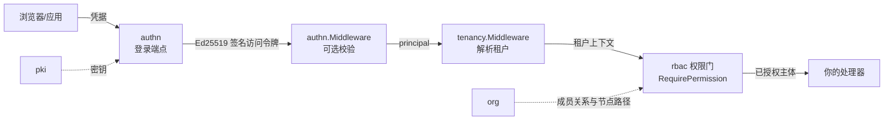

# 身份与访问

这个领域回答:你的用户是谁、他们怎么登录、能做什么。`authn` 模块
负责认证(密码、会话、MFA、社交与企业登录),`rbac` 负责授权(默认
拒绝,精确的 `resource:action` 授权),`org` 提供让授权有边界的组织
树与成员关系。`pki` 垫在下面,是 authn 访问令牌签发与验证的签名
密钥源。

中间件顺序是关键结构,由真实测试钉死:先 `authn.Middleware`
(有令牌就校验——坏令牌 401,无令牌保持匿名,绝不臆测租户),下一层
`tenancy.Middleware(authn.NewPrincipalResolver())` 把验证过的
principal 变成每个租户级仓库都需要的租户上下文。你的路由绝不能挂
在会猜租户的中间件下游,租户也绝不来自请求头。

## 最少集成步骤

1. **把模块接进你的内核。** 在 `Kernel.Bootstrap` 的模块集里加入
   `authn`、`rbac`、`org`(以及作为 authn 密钥源的 `pki`)。
   `dbkit.MigrationRegistry` 会应用每个模块自己的迁移;参考应用
   `examples/reference-app/cmd/server/server.go` 的启动注释逐行演示
   了确切接线顺序。
2. **给 authn 必选的接缝。** `authn.NewModule` 急切校验选项:`KeySource`
   (pki 的 `Service` 满足它)与盲索引密钥都是必填——两者都没有安全
   默认值;`MembershipReader` 在登录时回答「该用户是否是该租户成员」
   ——缺省即拒绝,绝不放行。
3. **按序挂中间件链。** authn 自己的子树直接从 `authn.Middleware`
   的输出挂出——绝不经过 `tenancy.Middleware`,因为登录发生在任何
   租户存在之前。其余一切路由用下游的
   `tenancy.Middleware(authn.NewPrincipalResolver())` 保护。
4. **用权限门护住路由。** rbac 在 `Kernel.Bootstrap` 之后执行
   `Attach`(冻结所有模块声明的权限词汇表——授予词汇表外的任何东西
   都会被拒绝)。用 `rbac.RequirePermission("notes", "write")` 或其
   `*Func` 变体护住操作;org 导出它自己四条路由声明的权限
   (`PermissionRead`、`PermissionManage`、`PermissionInviteMember`、
   `PermissionRemoveMember`)供你同样使用。
5. **让身份数据走 org 的流程。** 注册用户后,通过 `org` 的邀请流把
   他们请进一个租户节点;被接受的成员关系就是你的
   `MembershipReader` 与 rbac 主题解析看到的东西。

## 值得知道的边界

- 访问令牌短时有效、Ed25519 签名;刷新令牌单次使用,重放会使整族
  令牌轮换并吊销会话——客户端必须串行化刷新。
- 社交/企业登录按受信提供者的已验证邮箱绑定,绝不只凭邮箱同名合并;
  最后登录方式约束让纯社交账号无法甩掉自己的渠道。
- 所有暴露存在性的应答(用户存在、邮箱被占、提供者已绑)都被抑制:
  枚举什么也学不到。
- 登录、注册与 step-up 都在滑窗限流与渐进锁定的后面;step-up 验证
  恰好活过一个访问令牌。

## 下一步

每个模块的完整 API 面——选项、处理器、错误码——在模块参考的
`authn`、`rbac`、`org`、`pki` 各自页面。本领域应答的错误码在
[错误码索引](../../error-codes/)。

## Source

- [authn AGENTS.md](https://github.com/vislake/speed/blob/main/go/authn/AGENTS.md)
- [rbac AGENTS.md](https://github.com/vislake/speed/blob/main/go/rbac/AGENTS.md)
- [org AGENTS.md](https://github.com/vislake/speed/blob/main/go/org/AGENTS.md)
- [pki AGENTS.md](https://github.com/vislake/speed/blob/main/go/pki/AGENTS.md)
