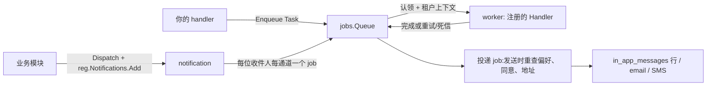

# 任务与通知

异步的一半由两个模块承担:`jobs` 运行后台工作(一个可移植的队列契
约、两个实现),`notification` 是消息面——你的产品发出的每条消息都走
一个已声明的通知类型,投递到收件箱、邮箱或手机号。



## 后台工作:jobs 队列

任何不该在 HTTP 请求内同步跑的操作——长任务、需要重试的工作、响应
发出后仍要发生的工作——都走 `jobs.Queue`。队列是一个小巧的可移植契
约(`Enqueue` / `Get` / `Cancel`),背后是同一个接缝的两个实现:
`StandaloneQueue`(SQLite 支撑,单进程部署)与 `go/jobs/queue/asynq` 的
Redis 支撑 `asynq.Queue`(分布式部署)。你的代码只面向 `Queue` 接口;
跑哪个实现是组装层决定。

- 任务是一个 `Task{Type, TenantID, Payload, IdempotencyKey}`——租户
  **在任务上**,不继承自调用方的 context,因为 worker 在几分钟后
  的另一 context 上运行。队列在每次 `Handle` 调用前重建租户上下文,
  注册的 `Handler` 收到的 `ctx` 已携带 `job.TenantID`。
- 每种任务类型注册一个 `Handler`(`NewHandlerFunc(type, fn)` 把普通
  函数适配成 handler),在 `Start` 之前注册;handler 通过
  `ProgressFn` 回调报告进度,job 记录的状态走
  `pending → running → retrying → succeeded`(或 `dead-letter`)。
- 重试与退避是队列的事(默认 `DefaultMaxRetries = 3`,每次调用可配
  `WithMaxRetries`/`WithDelay`/`WithPriority`)。**补偿不是**:当 job
  耗尽重试进入死信,handler 可以实现 `OnFailure` 跑业务补偿(退信用
  点、关预约)——那个钩子属于你的业务模块,永远不属于队列层。

最少接线(独立形态):

```go
q := jobs.NewStandaloneQueue(db)   // db 来自 dbkit.Open
q.RegisterHandler(jobs.NewHandlerFunc("notes.export", exportHandler))
q.Start(ctx)                        // 在任何 Enqueue 之前
defer q.Close(ctx)
```

## 消息面:notification

每种通知类型是**声明的,不是存模板**:你的模块在 `Register` 期间把
类型注册到内核注册表(`reg.Notifications.Add(...)`),每个类型带其偏
好组、默认通道与收件人能否退订(验证码是事务性的,不可退订)。文案
存在声明模块自己的双语 locale 包里,投递时按收件人 locale 渲染——
绝不在注册时捕获。

接线 `notification.NewModule` 有六个必选选项,缺任何一个 `Register`
都以各自的错误拒绝:SMS sender、邮件 from 地址、两个联系人盲索引器
(加密的联系人地址只能通过它们查询)、投递队列,以及一个在发送时读
取用户收件人外发地址的 `UserAddressResolver`。

三条收件人路径,一条铁律——**一切在发送时重查,绝不冻结进 payload**:

- **用户投递**——`Dispatch` 通过实时偏好矩阵解析收件人通道(类型声
  明的默认值,被逐类型 × 逐通道的选择覆盖,退订对该类型是终态的),
  渲染文案,收件箱通道落一行 `in_app_messages`,每通道结算一行
  `send_records`。
- **外部联系人**——联系地址必须完成同意验证(`double_opt_in` 码以
  哈希存于行上;验证消息本身是"先同意后发送"规则的唯一例外)。
  `unsubscribed` 与 `bounced` 是每次投递都拒绝的终态。验证尝试在
  查验码之前先扣每地址预算。
- **收件箱投递**——行提交后才发 `notification.inbox.created`,SSE
  流(`GET /api/v1/notifications/stream`)按"先行后事件"的顺序宣告。

## 下一步

- `jobs` 与 `notification` 的完整逐模块页(用法、选项、示例)将落在
  本栏的模块参考区。
- [错误码索引](../../error-codes/)——这两个模块可能应答的全部错误码。
