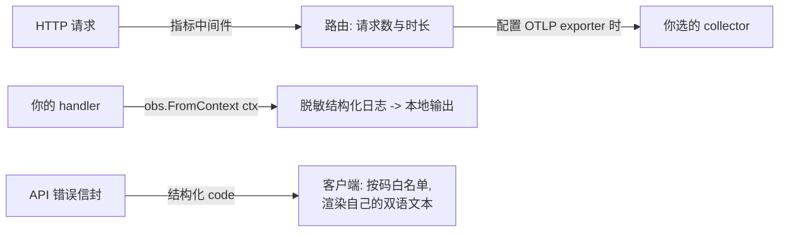

# 可观测与运维

`observability` 是每个 speed 服务都会碰的模块:初始化 OpenTelemetry、
提供你的代码从上下文取的结构化日志器、挂一个记录请求指标的 HTTP 中
间件。本页还覆盖对 API 客户端最重要的运维契约——每个应答携带的结
构化错误码。



## 接线

启动时初始化一次:`observability.Init(ctx, opts...)`。不声明部署模式
——exporter 的选择全在选项:设了 `WithOTLPEndpoint` 时指标与追踪经
OTLP 导出到该端点(分布式形态,经 `exporter/otlp` 空导入);日志在任
何组合里都留在本地——脱敏结构化日志器写进程自己的输出,平台不附带
OTLP 日志 exporter。没设端点时输出全部留在本地(控制台诊断)。一个
HTTP `Middleware` 在基数受限的路由标签后记录请求数与时长指标。

## 结构化日志

从上下文取日志器,绝不取包级一个:`obs.FromContext(ctx)` 返回携带
trace 与租户关联的日志器。两条铁律:

- 消息是常量字符串;一切变量进键值属性(`tenant_id`、`user_id`、
  `job_id`、`duration_ms`——全站 snake_case)。
- 脱敏层在每个 sink 前,默认开启,遮蔽敏感属性键与形似秘密的值。
  没有按调用关掉的出口:明文秘密无法意外到达日志、trace 或指标。
  指标要守的一条推论:`tenant_id` 永远不成指标标签(高基数)——租户
  维度只属于 span 属性与日志字段。

## 错误码契约

你 API 的每个拒绝都带结构化码——`module.snake_case`——在响应信封里,
而码就是契约。客户端处理三条规则:

1. 按码分支,绝不按 HTTP 状态或消息文本:状态只分大类,消息文本随
   locale 变,码是稳定的。
2. 给用户看的文本来自你自己的双语资源,以码为键——码的 locale 条目
   供对照,不是拿来显示的。
3. 维护一个可达码白名单并带兜底,让你没预料到的码渲染成你自己的
   `unknown` 文本,绝不显示裸键。

speed 系服务可能应答的全部码清单——状态、locale 消息、触发条件与出
处——见[错误码索引](../../error-codes/)。

## 下一步

- `observability` 的完整逐模块页(选项、exporter 细节)将落在本栏的
  模块参考区。

## 完整示例:给小型 Go 服务接上可观测性

假设你正在起自己产品的后端服务,想在业务代码长起来之前先把可观测
性接线放好。下面是一个完整、可运行的最小骨架——与参考应用启动时
同一个形状:启动时初始化一次模块,带上服务名与可选的 OTLP 端点;
把 JSON 日志器挂到基础上下文;从一个请求 handler 里记一条结构化
日志;用指标中间件包住 mux。

```go
// main.go -- a complete runnable skeleton of the observability wiring.
package main

import (
	"context"
	"log/slog"
	"net"
	"net/http"
	"os"
	"time"

	obs "github.com/vislake/speed/go/observability"
	// Registers the OTLP exporter factory Init consults when a
	// non-empty WithOTLPEndpoint is supplied; without this blank
	// import, that same Init fails with obs.ErrOTLPExporterNotRegistered.
	_ "github.com/vislake/speed/go/observability/exporter/otlp"
	// Registers the local scrape reader behind obs.MetricsHandler, so
	// GET /metrics answers while no OTLP endpoint is configured.
	_ "github.com/vislake/speed/go/observability/exporter/prometheus"
)

func main() {
	if err := run(); err != nil {
		// The one unlogged exit: nothing is initialized yet.
		os.Exit(1)
	}
}

func run() error {
	// A JSON logger on the base context. Request handlers reach it
	// through obs.FromContext(r.Context()), which attaches
	// trace_id/span_id when the middleware's span is in the context.
	baseCtx := obs.WithLogger(context.Background(), slog.New(slog.NewJSONHandler(os.Stdout, nil)))

	shutdown, err := obs.Init(baseCtx,
		obs.WithServiceName("notes-api"),
		obs.WithOTLPEndpoint(os.Getenv("OTLP_ENDPOINT")), // empty keeps the local exporters
	)
	if err != nil {
		return err
	}
	defer shutdown(context.Background()) // flushes spans and metrics on exit

	mux := http.NewServeMux()
	mux.HandleFunc("GET /healthz", func(w http.ResponseWriter, r *http.Request) {
		w.WriteHeader(http.StatusOK)
	})
	mux.Handle("GET /metrics", obs.MetricsHandler())
	mux.HandleFunc("GET /api/v1/notes", func(w http.ResponseWriter, r *http.Request) {
		start := time.Now()
		// In a composed service this handler sits behind
		// tenancy.Middleware, which answers anonymous callers itself
		// before the handler ever runs (the refusal demo below).
		noteID := "9f8a1c2e-0000-4000-8000-000000000001"
		obs.FromContext(r.Context()).Info("note opened",
			"note_id", noteID,
			"duration_ms", time.Since(start).Milliseconds(),
		)
		w.Header().Set("Content-Type", "application/json")
		w.Write([]byte(`{"id":"` + noteID + `"}`))
	})

	instrumented := obs.Middleware(mux)

	srv := &http.Server{
		Addr:    ":8080",
		Handler: instrumented,
		// Every request's context descends from baseCtx, so the logger
		// attachment above reaches handler code.
		BaseContext: func(net.Listener) context.Context { return baseCtx },
	}
	obs.FromContext(baseCtx).Info("server listening", "addr", srv.Addr)
	return srv.ListenAndServe()
}
```

从上往下走一遍接线。`obs.WithLogger` 把手建的 JSON 日志器挂到一个
基础上下文上,每个请求经 `http.Server.BaseContext` 继承它。
`obs.Init` 返回进程 defer 掉的 shutdown 函数,退出时把缓冲的 span
与指标冲刷出去。handler 里的 `obs.FromContext(r.Context())` 返回的
就是同一个日志器,并带上中间件为本请求开的 span 的
`trace_id`/`span_id`。两个空白导入是承重的:`exporter/otlp` 注册
`Init` 一旦配置了端点就需要的那份 exporter 工厂(没有它 `Init` 会以
`obs.ErrOTLPExporterNotRegistered` 失败,错误文本恰好点名这个导入),
`exporter/prometheus` 则把 `obs.MetricsHandler()` 从一段解释性 404
变成真正的抓取端点。`OTLP_ENDPOINT` 为空时保持本地 exporter——trace
与指标进 stdout;非空时两个信号都改经 OTLP/gRPC 推给该 collector,
默认走 TLS,绝不静默回退。

**一个带码的拒绝实际长什么样。** 在组合好的服务里,上面的路由在
`tenancy.Middleware` 之后——请求不携带租户时,中间件在 handler 运行
之前就把它拒了。启动参考应用(`examples/reference-app/` 目录下
`go run ./cmd/server`,默认监听 8080 端口),不带任何凭据去要笔记
列表:

```console
$ curl -i http://localhost:8080/api/v1/notes
HTTP/1.1 403 Forbidden
...
{"code":"tenancy.tenant_unresolved"}
```

这个响应体就是全部契约:状态给大类、码给分支、没有可解析的消息文
本。参考应用自己的流程测试把这个响应体逐字节钉死。

**跑起来。** 把文件存成 `main.go`,放进一个 require
`github.com/vislake/speed/go/observability` 的模块,然后:

1. `go run .`——服务打印 `server listening` 并在 `:8080` 监听。
2. `curl -i http://localhost:8080/api/v1/notes`——以笔记 JSON 应答
   `200`,stdout 出现结构化行
   `{"time":...,"level":"INFO","msg":"note opened","trace_id":...,
   "span_id":...,"note_id":...,"duration_ms":0}`——两个 id 字段来自
   上下文,不是你的调用点传的。
3. `curl -s http://localhost:8080/metrics`——出现请求计数器
   `http_server_request_count_total`,按方法、状态与路由打标签;刚才
   那个请求给它加了一。
4. 带 `OTLP_ENDPOINT=collector.example.com:4317 go run .` 重跑——
   两个信号现在都推给 collector,`GET /metrics` 改答它的解释性 404
   (没有本地 registry 可抓)。只有显式 `WithOTLPInsecure` 才允许把
   端点指向明文监听。

**在参考应用里看到它**——同样的接线,collector 端点从 bootstrap 配
置读取,两个 exporter 都以空白导入挂上:
[`examples/reference-app/cmd/server/main.go`](https://github.com/vislake/speed/blob/main/examples/reference-app/cmd/server/main.go)
与
[`examples/reference-app/internal/app/server.go`](https://github.com/vislake/speed/blob/main/examples/reference-app/internal/app/server.go)。

一个关键点:上面每条日志与每个指标都来自接线本身,不是业务代码
——你的 handler 只调 `obs.FromContext(ctx)` 与中间件,trace/租户关
联自动跟上。
