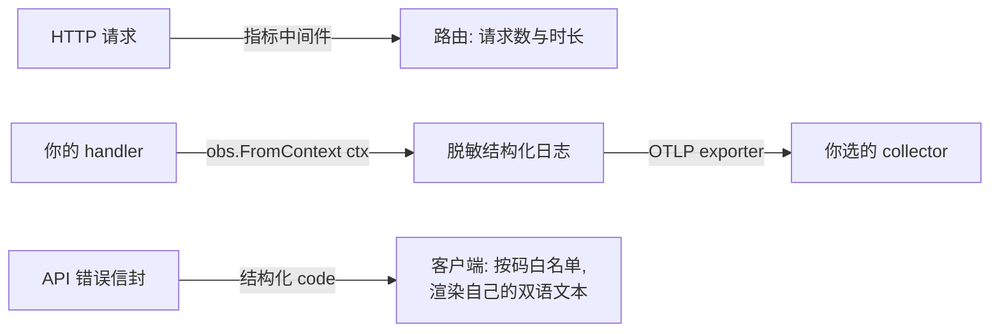

# 可观测与运维

`observability` 是每个 speed 服务都会碰的模块:初始化 OpenTelemetry、
提供你的代码从上下文取的结构化日志器、挂一个记录请求指标的 HTTP 中
间件。本页还覆盖对 API 客户端最重要的运维契约——每个应答携带的结
构化错误码。

## 接线

启动时初始化一次:`observability.Init(ctx, opts...)`。不声明部署模式
——exporter 的选择全在选项:设了 `WithOTLPEndpoint` 时日志、指标与
追踪经 OTLP 导出到该端点(分布式形态);没设时输出留在本地(控制台
诊断)。一个 HTTP `Middleware` 在基数受限的路由标签后记录请求数与
时长指标。

## 结构化日志

从上下文取日志器,绝不取包级一个:`obs.FromContext(ctx)` 返回携带
trace 与租户关联的日志器。两条铁律:

- 消息是常量字符串;一切变量进键值属性(`tenant_id`、`user_id`、
  `job_id`、`duration_ms`——全站 snake_case)。
- 脱敏层在每个 sink 前,默认开启,遮蔽敏感属性键与形似秘密的值。
  没有按调用关掉的出口:明文秘密无法意外到达日志、trace 或指标。
  指标要守的一条推论:`tenant_id` 永远不成指标标签(高基数)——租户
  维度只属于 span 属性与日志字段。

## 错误码契约

你 API 的每个拒绝都带结构化码——`module.snake_case`——在响应信封里,
而码就是契约。客户端处理三条规则:

1. 按码分支,绝不按 HTTP 状态或消息文本:状态只分大类,消息文本随
   locale 变,码是稳定的。
2. 给用户看的文本来自你自己的双语资源,以码为键——码的 locale 条目
   供对照,不是拿来显示的。
3. 维护一个可达码白名单并带兜底,让你没预料到的码渲染成你自己的
   `unknown` 文本,绝不显示裸键。

speed 系服务可能应答的全部码清单——状态、locale 消息、触发条件与出
处——见[错误码索引](../../error-codes/)。

## 下一步

- `observability` 的完整逐模块页(选项、exporter 细节)将落在本栏的
  模块参考区。
