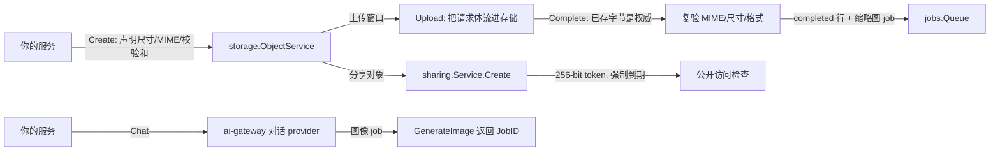

# 存储、分享与 AI

媒体与智能的一侧由三个模块覆盖:`storage` 拥有对象字节与它们的元数
据生命周期,`sharing` 把对象变成带时限的公开链接,`ai-gateway` 在
一个与厂商无关的网关后面承接 LLM 对话与图像生成。

## storage:字节永不进你的数据库

`storage` 把元数据放在租户作用域的表里,字节走内核解析的
`ObjectStore` 接缝,键由模块自己推导——绝不收你提供的键。上传生命
周期是三步协议:

1. `Create` 按你声明的尺寸、MIME 类型、校验和与可选的请求保留期
   (受宿主上限约束)开一个上传窗口。行处于 `uploading`。
2. `Upload` 把请求体流进存储。
3. `Complete` 复验实际到达的东西——**已存字节是你声明的权威**:真实
   尺寸与 MIME、字节与像素上限、结构性元数据剥离(JPEG APP 段、PNG
   eXIf;walker 无法结构验证的文件一律拒绝)。它定稿行并入队缩略图
   派生任务。

删除是崩溃收敛协议(`LifecycleService`):把行标成 `deleting`,删对象
字节,删每个派生字节,再在一个事务里删行——任一步被打断都由下一次
运行收敛,绝不重复。按租户的过期清扫(`EnqueueExpirySweep`)续跑被
打断的删除,回收窗口已关的过期 `uploading` 行。

## sharing:五条规则,没有例外

`sharing.Service` 把资源变成公开链接,并强制执行五条规则:256-bit
`crypto/rand` token;带默认到期的强制设置,不存在永不过期选项;撤销在
下一次访问检查即生效(模块内无任何缓存);完整访问日志;所有拒绝理由
对外回答完全一致(链接探测学不到任何"为什么")。单次浏览在投递时消
费——服务按信用账本确立的"预留/确认/退款"形状先预留、后结算。模块
的公开访问路由(`GET /api/v1/sharing/access`)对未认证请求回
`Cache-Control: no-store`;宿主提供 `ResourceResolver` 把已授出的分享
变成真实字节,创建与访问两侧都有限流守护。

## ai-gateway:一个面,多家厂商

`ai-gateway` 天生与厂商无关:每个 provider 实现 `ChatProvider`
(`Chat` / `ChatStream`),按名注册在接缝注册表上;默认实现是
OpenAI 兼容的,大多数厂商根本不需要适配器。对话默认同步。图像生成
只异步:`Gateway.GenerateImage` 恰好入队一个 job 并返回其 `JobID`——
图像工作绝不跑在 HTTP 请求内。provider 凭据是 BYOK,以作用域分层
(平台与租户)加密存储在静态处,可经凭据 HTTP 面写入,租户可写的
base URL 在拨号时受 SSRF 防护。用量记录与权益检查是可选的
结构化接缝,宿主可接到 `metering` 与 `billing`。

## 下一步

- `storage`、`sharing` 与 `ai-gateway` 的完整逐模块页(选项、示例)将
  落在本栏的模块参考区。
- [错误码索引](../../error-codes/)——这些模块可能应答的全部错误码。
