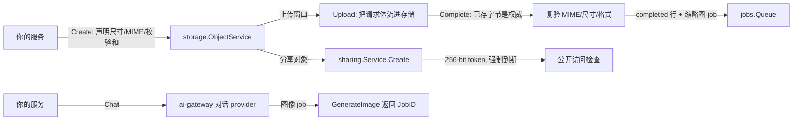

# 存储、分享与 AI

媒体与智能的一侧由三个模块覆盖:`storage` 拥有对象字节与它们的元数
据生命周期,`sharing` 把对象变成带时限的公开链接,`ai-gateway` 在
一个与厂商无关的网关后面承接 LLM 对话与图像生成。



## storage:字节永不进你的数据库

`storage` 把元数据放在租户作用域的表里,字节走装配解析的
`ObjectStore` 模块,键由模块自己推导——绝不收你提供的键。上传生命
周期是三步协议:

1. `Create` 按你声明的尺寸、MIME 类型、校验和与可选的请求保留期
   (受宿主上限约束)开一个上传窗口。行处于 `uploading`。
2. `Upload` 把请求体流进存储。
3. `Complete` 复验实际到达的东西——**已存字节是你声明的权威**:真实
   尺寸与 MIME、字节与像素上限、结构性元数据剥离(JPEG APP 段、PNG
   eXIf;walker 无法结构验证的文件一律拒绝)。它定稿行并入队缩略图
   派生任务。

删除是崩溃收敛协议(`LifecycleService`):把行标成 `deleting`,删对象
字节,删每个派生字节,再在一个事务里删行——任一步被打断都由下一次
运行收敛,绝不重复。按租户的过期清扫(`EnqueueExpirySweep`)续跑被
打断的删除,回收窗口已关的过期 `uploading` 行。

## sharing:五条规则,没有例外

`sharing.Service` 把资源变成公开链接,并强制执行五条规则:256-bit
`crypto/rand` token;带默认到期的强制设置,不存在永不过期选项;撤销在
下一次访问检查即生效(模块内无任何缓存);完整访问日志;所有拒绝理由
对外回答完全一致(链接探测学不到任何"为什么")。单次浏览在投递时消
费——服务按信用账本确立的"预留/确认/退款"形状先预留、后结算。模块
的公开访问路由(`GET /api/v1/sharing/access`)对未认证请求回
`Cache-Control: no-store`;宿主提供 `ResourceResolver` 把已授出的分享
变成真实字节,创建与访问两侧都有限流守护。

## ai-gateway:一个面,多家厂商

`ai-gateway` 天生与厂商无关:每个 provider 实现 `ChatProvider`
(`Chat` / `ChatStream`),按名注册在模块自己的组件注册表上;默认实现是
OpenAI 兼容的,大多数厂商根本不需要适配器。对话默认同步。图像生成
只异步:`Gateway.GenerateImage` 恰好入队一个 job 并返回其 `JobID`——
图像工作绝不跑在 HTTP 请求内。provider 凭据是 BYOK,以作用域分层
(平台与租户)加密存储在静态处,可经凭据 HTTP 面写入,租户可写的
base URL 在拨号时受 SSRF 防护。用量记录与权益检查是可选的
结构化模块接口,宿主可接到 `metering` 与 `billing`。

## 完整示例:一张患者照片的旅程——上传、派生、分享

诊所把患者的微笑模拟结果图(一张 PNG)传上 `storage`;三步上传协议完
成后,`storage` 把「生成缩略图」任务入队,队列 worker(在队列组件
自己的 `Start` 里以 `jobs.Wire` 从注册表的 jobs 席位接入,与参考
应用的组装一致)写出派生行。诊所随后为这张
已完成的图给患者铸一条分享链接,患者在无任何认证的情况下打开它,
之后一次撤销让紧接着的下一次访问立即被拒。演练在单进程里、用内存
SQLite 数据库和真实装配跑完全部流程——独立部署模式的寻
常形态。

前置条件:你的消费模块在 `go.mod` 里用 `replace` 把各 speed 模块指
到本地 checkout(`go mod tidy` 之后即可);把代码粘进你自己 `main` 包
的文件里运行。结尾的 AI 半段是宿主代码,只为展示真实调用形态——
它需要已配置的 BYOK 凭据,不在这段演练里运行。

```go
import (
	"bytes"
	"context"
	"fmt"
	"image"
	"image/color"
	"image/png"
	"time"

	_ "github.com/vislake/speed/go/dbkit/dialect/sqlite" // registers DialectSQLite
	"github.com/vislake/speed/go/pkgcore"
	"github.com/vislake/speed/go/sharing"
	"github.com/vislake/speed/go/storage"
)

// must keeps the walk readable; a real host returns coded errors instead.
func must(err error) {
	if err != nil {
		panic(err)
	}
}

func uploadDeriveAndShare() {
	ctx := pkgcore.WithTenant(context.Background(), pkgcore.TenantID("acme-dental"))

	// A real assembly: the composition selects the database, the standalone
	// jobs queue, storage and sharing, so the engine constructs each module
	// — storage's queue comes from the selection, and the queue's own Start
	// wires every handler the modules declared, so a real worker derives
	// the thumbnail. (hostConfig, loaderOpts and the composition override
	// that names those selections are the host's own bootstrap wiring —
	// placeholders in this walk.)
	reg := pkgcore.NewComponentRegistry()
	err := app.Assemble(ctx, reg, app.LoadSpec{Host: &hostConfig, Options: loaderOpts})
	must(err)

	// Read every piece back from the registry. A hand-built module instance
	// the engine never drove would leave its services lazily unattached:
	// ObjectService and Service fail closed with ErrServiceNotAttached on
	// the first call.
	media, err := pkgcore.Get[*storage.Module](reg)
	must(err)
	links, err := pkgcore.Get[*sharing.Module](reg)
	must(err)
	// An 8x8 PNG stands in for the simulation result image.
	var buf bytes.Buffer
	img := image.NewRGBA(image.Rect(0, 0, 8, 8))
	for y := 0; y < 8; y++ {
		for x := 0; x < 8; x++ {
			img.SetRGBA(x, y, color.RGBA{uint8(16 * x), uint8(16 * y), 128, 255})
		}
	}
	must(png.Encode(&buf, img))
	content := buf.Bytes()
	svc := media.ObjectService()
	// Transfer step 1: declare the upload (row is uploading; the store
	// key is derived by the module itself, never caller-supplied).
	row, err := svc.Create(ctx, storage.CreateParams{
		DeclaredSize: int64(len(content)),
		DeclaredType: "image/png",
	})
	must(err)
	fmt.Println("upload declared:", row.State)
	// Transfer step 2: stream the bytes into the object store.
	must(svc.Upload(ctx, row.ID, nil, bytes.NewReader(content)))
	// Transfer step 3: Complete revalidates what actually arrived (size,
	// MIME, the structural metadata strip) and enqueues the
	// thumbnail-derive task.
	completed, err := svc.Complete(ctx, row.ID)
	must(err)
	fmt.Println("object completed:", *completed.MIME)
	// The queue's worker derives the thumbnail; wait for the row.
	deadline := time.Now().Add(5 * time.Second)
	for {
		derivatives, err := media.Derivatives().List(ctx)
		must(err)
		if len(derivatives) > 0 {
			fmt.Println("thumbnail derived:", derivatives[0].Kind)
			break
		}
		if time.Now().After(deadline) {
			fmt.Println("timed out waiting for the thumbnail")
			return
		}
		time.Sleep(10 * time.Millisecond)
	}
	// Mint the patient's link. ResourceRef is opaque to sharing; your
	// ResourceResolver maps the "storage:" form back to bytes on serve.
	created, err := links.Service().Create(ctx, sharing.CreateParams{
		ResourceRef: "storage:" + row.ID,
	})
	must(err)
	fmt.Println("share created (token returned exactly once)")
	// The patient opens the link — unauthenticated, exactly like the
	// public access route's handler.
	_, err = links.Service().AccessPublic(context.Background(), created.Token, sharing.AccessParams{
		IP: "203.0.113.7",
	})
	must(err)
	fmt.Println("patient access granted (access logged)")
	// Revocation takes effect on the very next access check: no cache
	// anywhere in the module to invalidate.
	must(links.Service().Revoke(ctx, created.Share.ID))
	_, err = links.Service().AccessPublic(context.Background(), created.Token, sharing.AccessParams{})
	fmt.Println("access after revoke:", err)
}
```

同一产品的 AI 半段——网关模块用 `WithModelRoute` 组装(图像
还需要 `WithImageGeneration(queue, objects)`),BYOK 凭据配置在平台或
租户层,业务代码只碰两个入口:

```go
import aigateway "github.com/vislake/speed/go/ai-gateway"

gateway := aiModule.Gateway() // aiModule: aigateway.NewModule(db, opts...)

// Chat is synchronous by default: one round trip, then the reply.
reply, err := gateway.Chat(tenantCtx, aigateway.ChatRequest{
	Model: "chat:default", // a WithModelRoute key, resolved at NewModule time
	Messages: []aigateway.ChatMessage{
		{Role: aigateway.RoleUser, Content: "Summarize this case in one sentence."},
	},
})
if err != nil {
	fmt.Println("chat:", err)
	return
}
fmt.Println("ai summary:", reply.Message.Content)

// Image generation is async-only: GenerateImage enqueues exactly one
// job and returns its JobID — image work never runs inside an HTTP
// request; the result is a go/storage object id read back via Queue.Get.
imageJobID, err := gateway.GenerateImage(tenantCtx, aigateway.ImageRequest{
	Model:        "image:default",
	Operation:    aigateway.ImageOperationImageToImage,
	Prompt:       "Make the smile more natural",
	InputObjectID: row.ID, // the object completed in the walk above
})
if err != nil {
	fmt.Println("generate image:", err)
	return
}
fmt.Println("image job enqueued:", imageJobID)
```

这段演练演示的契约事实:三步协议让*已存的字节*成为权威——`Complete`
复验尺寸、MIME 与结构,而不是相信上传者的声明,只有通过后才变成可
读对象并发出派生任务;sharing 的五条规则没有例外——token 只铸一次,
撤销拒绝紧接着的下一次检查;AI 图像工作天生异步,字节跨模块边界只
以 `go/storage` 对象 id 的形式流动。

运行步骤:

1. 在你的消费 `go.mod` 里为 `go/app`、`go/dbkit`、`go/pkgcore`、
   `go/jobs`、`go/storage`、`go/sharing` 加 `replace` 行,然后
   `go mod tidy`。
2. 把第一个代码块放进你自己 `main` 包的文件,补齐宿主占位符
   (`hostConfig`、`loaderOpts`,以及选中 db、队列、storage 与
   sharing 组件的组合覆盖层),然后运行 `go run .`。
3. 演练会从零迁移两个模块、驱动真实装配、经真实队列 worker
   派生缩略图然后退出——不需要 Docker。

预期输出:

```text
upload declared: uploading
object completed: image/png
thumbnail derived: thumbnail
share created (token returned exactly once)
patient access granted (access logged)
access after revoke: sharing.not_accessible
```

在参考应用中看到它:

- [examples/reference-app/flowtests/storage_flow_test.go](https://github.com/vislake/speed/blob/main/examples/reference-app/flowtests/storage_flow_test.go)
  与 [examples/reference-app/flowtests/sharing_flow_test.go](https://github.com/vislake/speed/blob/main/examples/reference-app/flowtests/sharing_flow_test.go)
  ——同样的旅程(上传、净化、派生、下载、删除;创建、访问、撤销)在
  真实 HTTP 上、经组合栈驱动;异步图像生成那一腿见
  [examples/reference-app/flowtests/smilesim_flow_test.go](https://github.com/vislake/speed/blob/main/examples/reference-app/flowtests/smilesim_flow_test.go)。
- [go/storage/example_test.go](https://github.com/vislake/speed/blob/main/go/storage/example_test.go)
  ——本演练的传输生命周期,由模块自己的单元套件编译并执行。

## 下一步

- `storage`、`sharing` 与 `ai-gateway` 的完整逐模块页(选项、示例)将
  落在本栏的模块参考区。
- [错误码索引](../../error-codes/)——这些模块可能应答的全部错误码。
