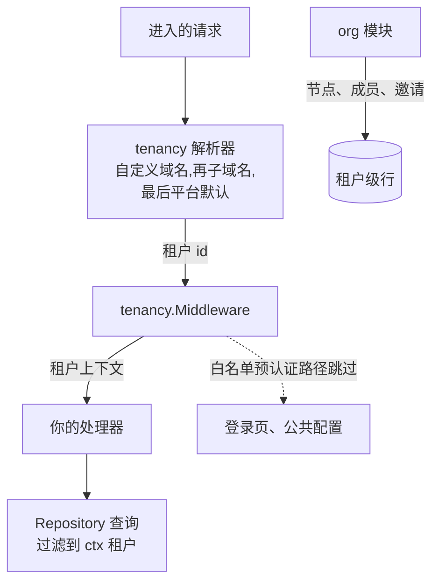

# 多租户与组织

speed 产品里的每个请求都以*某个*租户的身份运行——这就是隔离模型,
它有三层防护(GORM 插件自动注入租户过滤、强制的 `dbkit.Repository[T]`
基座、分布式部署下的 PostgreSQL 行级安全)。`tenancy` 模块解析一个
请求属于哪个租户;`org` 模块给每个租户提供组织树、绑在树上的成员,
以及创建成员的邀请。



解析器是宿主提供的函数:`tenancy.NewDomainResolver` 按主机把请求映
射到租户;参考应用先自定义域名、再子域名、最后平台默认——解析失败
对登录页端点仍以 200 提供平台默认值,绝不出错。请求的租户从哪来是
框架的事:你的处理器用 `pkgcore.TenantFromContext(ctx)` 从上下文里
读,绝不接受来自头、参数或请求体的租户。

## 最少集成步骤

1. **挂中间件。** `tenancy.Middleware(resolver, opts...)` 包住你的
   mux;预认证路径(登录页、`/api/v1/config/public`)进白名单,其余一切
   在租户解析失败时失败关闭。
2. **排在认证之后。** 组合链里租户层在 `authn.Middleware` 下游,把
   验证过的 principal 变成租户上下文——完整顺序见身份与访问领域页。
3. **接 org 模块。** `org.NewModule(db, opts...)` 启动时需要两个必选
   接线(邮箱盲索引器与邀请链接构造器;不发邮件的宿主可用
   `WithInvitationEmailDisabled`);`Tree()`、`Members()`、
   `Invitations()` 是三个运行时。
4. **塑形组织树。** 在父节点下创建节点;每个节点带物化路径与深度。
   一次移动操作更新全部后代的路径——`org.node.moved` 的订阅者
   (rbac 的子树授权也在其中)靠事件收敛。
5. **用邀请加人。** 邀请是租户自己的流程:原始令牌从不落库(只存
   哈希),受邀者地址在盲索引下加密存储,投递按租户与按收件人双重
   限流。接受邀请即创建成员;成员可以按子树列出或移除。
6. **在自己的模块里证明隔离。** 每个租户数据仓库都必须跑
   `tenancytest.AssertIsolated`——正是会抓住缺失过滤器的套件。身份
   与平台表改跑 `AssertNotTenantScoped`。

## 值得知道的边界

- `users` 刻意**不**租户级:一个人可以属于多个租户;`memberships`
  是链接表。设计任何表之前,先把它归入四个数据域之一(租户/身份/
  平台/链接)。
- 唯一合法的跨租户通道是带审计的 `WithSystemContext` 逃生门,其使用
  被限制在平台自身的扩权目的(admin、compliance、jobs、authn)——
  业务代码绝不扩权。
- 软删节点不会挡住被删同级节点的名字:唯一索引是部分索引
  (`WHERE deleted_at IS NULL`),所以被删兄弟的名字与被移除成员的
  席位都可以复用。

## 下一步

完整 API 见模块参考中的 `tenancy` 与 `org` 页面;数据与配置领域页
讲租户级模型怎么声明与迁移。

## 完整示例:一家牙科集团、它的门店树与一次邀请

本节把本页的两半各演一遍,场景是一个多门店的牙科集团。先演 tenancy:
Host 为 `acme.example.com` 的请求解析到 `tenant-a`,未知 Host 回退到
配置的默认租户,客户端自报的租户提示被静默忽略。再在解析出的租户里
演 org:树长出一个集团根节点与两家门店,owner 加入集团,一位牙医被
邀请进北店并接受——于是名册与 `Scope` 的回答精确展示每个用户能看
到哪些节点。整个示例自足(内存 SQLite、无邮件——邀请邮件已禁用),
所用符号全部来自 `go/org` 与 `go/tenancy` 的真实 API(与 `go/org`
自带示例套件运行的是同一批调用)。

```go
package main

import (
	"context"
	"fmt"
	"net/http"
	"net/http/httptest"

	"github.com/vislake/speed/go/dbkit"
	_ "github.com/vislake/speed/go/dbkit/dialect/sqlite" // 注册 DialectSQLite
	"github.com/vislake/speed/go/org"
	"github.com/vislake/speed/go/pkgcore"
	"github.com/vislake/speed/go/tenancy"
)

func main() {
	ctx := context.Background()

	// org 把邀请地址加密存储,并用 HMAC 盲索引保证可查。两把独立的
	// 秘密:加密密钥与盲索引密钥绝不能是同一段字节。
	cipher, err := dbkit.NewCipher([]byte("example-email-cipher-key-32bytes"))
	if err != nil {
		panic(err)
	}
	dbkit.RegisterEncryptedSerializer(org.EmailSerializerName, cipher)
	indexer, err := dbkit.NewBlindIndexer(org.EmailIndexColumn,
		[]byte("example-blind-index-key-32-bytes"), dbkit.NormalizeEmail)
	if err != nil {
		panic(err)
	}

	db, err := dbkit.Open(ctx, dbkit.Options{Dialect: dbkit.DialectSQLite, DSN: "file:org_example?mode=memory&cache=shared"})
	if err != nil {
		panic(err)
	}

	// WithInvitationEmailDisabled 让示例不依赖真实邮件器;要投递邀请的
	// 宿主改接 WithMailFrom 与 WithInvitationLinkBuilder。
	module := org.NewModule(db,
		org.WithEmailIndexer(indexer),
		org.WithInvitationEmailDisabled(),
	)
	migrations := dbkit.NewMigrationRegistry()
	if err = migrations.Register(module); err != nil {
		panic(err)
	}
	if err = migrations.Apply(ctx, db, dbkit.DialectSQLite); err != nil {
		panic(err)
	}
	if _, err = pkgcore.NewKernel().Bootstrap(ctx, module); err != nil {
		panic(err)
	}

	// tenancy 半场:宿主把 Host 映射到租户;未知 Host 回退到配置的默认
	// 租户,客户端自报的租户提示被静默忽略——Host 是唯一租户来源。
	lookup := func(host string) (pkgcore.TenantID, bool) {
		if host == "acme.example.com" {
			return pkgcore.TenantID("tenant-a"), true
		}
		return "", false
	}
	mw := tenancy.Middleware(tenancy.NewDomainResolver(lookup, "public"))(
		http.HandlerFunc(func(w http.ResponseWriter, r *http.Request) {
			tenant, ok := pkgcore.TenantFromContext(r.Context())
			fmt.Printf("handler saw tenant=%q ok=%t\n", tenant, ok)
		}),
	)
	for _, host := range []string{"acme.example.com", "unknown.example.com"} {
		req := httptest.NewRequest(http.MethodGet, "/dashboard", nil)
		req.Host = host
		mw.ServeHTTP(httptest.NewRecorder(), req)
	}
	forged := httptest.NewRequest(http.MethodGet, "/dashboard", nil)
	forged.Host = "acme.example.com"
	forged.Header.Set("X-Tenant-ID", "someone-elses-tenant")
	mw.ServeHTTP(httptest.NewRecorder(), forged)

	// org 半场:真实请求里下面的租户正是 tenancy.Middleware 注入的那
	// 个;这里显式构造。
	ctx = pkgcore.WithTenant(ctx, "tenant-a")
	tree, members, invitations := module.Tree(), module.Members(), module.Invitations()

	group, err := tree.CreateRoot(ctx, "Acme Dental", "group")
	if err != nil {
		panic(err)
	}
	north, err := tree.CreateChild(ctx, group.ID, "North Store", "store")
	if err != nil {
		panic(err)
	}
	if _, err = tree.CreateChild(ctx, group.ID, "South Store", "store"); err != nil {
		panic(err)
	}
	if _, err = members.Add(ctx, "user-owner", group.ID); err != nil {
		panic(err)
	}

	// 邀请令牌恰好返回一次,是持票人凭据:它只该出现在发给受邀者的
	// 消息里,别处都不该有。
	invite, err := invitations.Invite(ctx, org.InviteRequest{
		Email: "dentist@example.test", NodeID: north.ID,
		InviterUserID: "user-owner", Locale: "en-US",
	})
	if err != nil {
		panic(err)
	}
	if _, err = invitations.Accept(ctx, invite.Token, "user-dentist"); err != nil {
		panic(err)
	}

	roster, err := members.List(ctx, group.ID)
	if err != nil {
		panic(err)
	}
	fmt.Printf("members under the group: %d\n", len(roster))

	scope := module.Scope()
	for _, userID := range []string{"user-owner", "user-dentist", "user-stranger"} {
		visible, err := scope.MemberNodeIDs(ctx, userID)
		if err != nil {
			panic(err)
		}
		fmt.Printf("%s can see %d node(s)\n", userID, len(visible))
	}
}
```

**每段程序在做什么。** `tenancy.Middleware` 从请求的 Host 解析租
户——绝不从头里取——并注入上下文;处理器(以及下面每个 org 调用)
用 `pkgcore.TenantFromContext` 读回它。注意没有任何 org 调用带租户
参数:租户只在上下文里流动,调用者因此不可能指名别人的租户。盲索引
器的列参数用的是 org 导出的 `org.EmailIndexColumn` 常量,不是手打字
符串。

**怎么跑。** 在本仓库的 checkout 旁建一个临时模块,把上面的文件放
进去,用 `replace` 行把 import 指向 checkout——程序 import 的每个模块
一行,例如 `replace github.com/vislake/speed/go/org => /path/to/checkout/go/org`——
然后以 `GOWORK=off` 运行 `go mod tidy` 与 `go run .`(别让 checkout
自己的 `go.work` 渗进构建)。tidy 会拉取一次第三方依赖。

**预期结果。** 程序在 stdout 打印下面七行;内核自己的接缝组合日志行
(含内存接缝的 `WARN`)先打到 stderr:

```
handler saw tenant="tenant-a" ok=true
handler saw tenant="public" ok=true
handler saw tenant="tenant-a" ok=true
members under the group: 2
user-owner can see 3 node(s)
user-dentist can see 1 node(s)
user-stranger can see 0 node(s)
```

前三行是 tenancy 半场:认识的域名解析到 `tenant-a`;未知 Host 回退到
`public` 默认租户(足够渲染登录页——绝不出错);伪造的
`X-Tenant-ID` 头改变不了任何东西。其余是 org 半场:站在集团节点上
的名册列出全部子树成员(owner 在集团节点、牙医在北店——
`List` 返回节点及其下所有节点的成员);`Scope.MemberNodeIDs` 给 owner
三个节点(集团、北店、南店),给牙医一个(只有自己的门店),给从未被
邀请的 stranger 零个。

**在参考应用中看到它。** 参考应用用真实组合出来的 HTTP 栈跑同样的
形态:[`flowtests/org_flow_test.go`](https://github.com/vislake/speed/blob/main/examples/reference-app/flowtests/org_flow_test.go)
是多层树、邀请被接受、按子树读回名册的完整旅程;
[`internal/app/demo/demo_subject.go`](https://github.com/vislake/speed/blob/main/examples/reference-app/internal/app/demo/demo_subject.go)
展示 org 的 HTTP 面如何再被 `rbac` 在边界处门控。在
`examples/reference-app` 里 `go run ./cmd/server`,与播种好的 demo 租户
对比即可。

## Source

- [tenancy AGENTS.md](https://github.com/vislake/speed/blob/main/go/tenancy/AGENTS.md)
- [org AGENTS.md](https://github.com/vislake/speed/blob/main/go/org/AGENTS.md)
- [dbkit AGENTS.md](https://github.com/vislake/speed/blob/main/go/dbkit/AGENTS.md)
