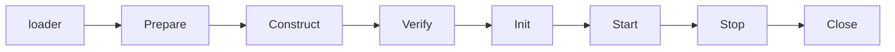

# app

app 是 speed 的**应用装配层**:每个应用自己的启动代码所基于的结构。
[总体架构页](/zh-cn/docs/developer-docs/architecture/)把它画在模块图
的顶层节点;它也是唯一**没有业务域**的模块:没有表、没有路由、没有
权限、不实现任何模块契约。它拥有的是宿主启动中本来会在每个宿
主里被手写一遍的那一半:配置装载、composition 计划、八阶段组件驱
动、关停时序与 HTTP 帮手(为什么无域模块仍然成立,见
[设计页](/zh-cn/docs/developer-docs/modules/app/))。

## 它做什么

一个 speed 应用由组件组装而成:平台模块、基础设施实现与宿主自己的
部件,每个都是注册在同一个 `pkgcore.ComponentRegistry` 上的
`pkgcore.Component`。引擎驱动这个注册表:

- **装载器**(`app.Assemble` 首先运行它)解析宿主的配置 target、
  composition 配置(组装哪些组件、用什么取值)以及每个组件声明的
  bootstrap key,然后把三者都发布进注册表——composition 尚不存在
  时,装配根本无从选择组件。
- **驱动器**把注册表依次走过装配各阶段:
  **Prepare → Construct → Verify → Init → Start → Serve**。
- **`app.Shutdown`** 执行两相关停:逆序的非阻塞 **Stop** 通知,然后
  是逆序的 **Close**,释放资源并聚合错误。
- **`app.RunAssembly`** 是进程的 Run 糖:建注册表、驱动、调用宿主的
  serve 步骤(可选 `ServeFunc`,拿到信号叠加后的 context 与活注册表;
  nil 则由引擎自己等 context),然后两相关停。

引擎**不含 HTTP 组装、不监听端口**——路由由 `http` 组件
(`go/app/httpserve`)组装声明面累积的路由,listener 由它自持。宿
主中立的 HTTP 帮手住在引擎旁边,供宿主组
装: `app.AuthnAPIPath`(authn 的挂载点)、
`app.ReadHeaderTimeout` / `app.ShutdownTimeout`(服务时限)与
`app.PreAuthAllowlist()`(豁免 healthz、metrics 与 config 两个
pre-auth 端点、覆盖 GET 与 HEAD 的 tenancy 选项)。

引擎自己也带一个组件:**observability 组件**,由本模块的 `init` 注
册、被内置 composition 默认选中,因此除非更高层取消,它总参与装
配。它的 `Prepare` 用解析出的 `service_name` / `otlp_endpoint` 块
初始化 OTel;它的 `Close` 关停 provider 并 flush。

## 何时选用

每个基于 speed 的宿主都 import 它——无论还组装什么,宿主的
`cmd/server` 就建在这个模块上。两个强制消费者是参考应用
(`examples/reference-app`,完整组装)与 `saasctl new` 物化出的项目
骨架(最小选集)。用哪个入口是你的决定:主动驱动注册表、由调用方
自己服务 handler 时用 `app.Assemble` + `app.Shutdown`;进程有自己
的生命周期时用 `app.RunAssembly`,serve 步骤经 `ServeFunc` 交回引擎
调用。

## 包布局与依赖成本

| 包 | 职责 | 谁付费 |
|---|---|---|
| `go/app`(根) | 引擎:装载器、驱动器、`RunAssembly`、共享 HTTP 帮手 | 每个组装 |
| `go/app/chain` | 固定中间件链:`chain.Standard`(从 http 组件的路由源推导)与 `chain.Chain`(自定义布局) | 组装链的宿主 |
| `go/app/httpserve` | `http` 组件:路由/中间件声明面、按宿主链路策略的 handler 组装与监听器 | 每个对外服务 HTTP 的组装 |
| `go/app/bridges` | 无 import 桥接:`Entitlements`、`UsageRecorder`、`OrgFeatureGate`、`AuthnFeatureGate`、`ShareExpiryReader` | 接这些模块的宿主 |

拆分依据是依赖成本,不是口味:根包的裸消费者付根包的闭包——36 条
`// indirect`,含 `config` 拖进的 GORM 栈——所以根绝不 import 链或
桥接的参与者;链的闭包以链自身参与者为界(含 authn 与 rbac);桥
接只由接线桥两端模块的宿主付费。

## 接线

```go
// 1. 宿主组件按序注册到新注册表。
reg := pkgcore.NewComponentRegistry()
for _, c := range hostComponents {           // 步骤组件、provider 组件
    if err := reg.Register(c); err != nil {
        return err
    }
}

// 2. 装载器的输入:宿主配置 target 与装载选项。
spec := app.LoadSpec{
    Host:    &hostConfig,                    // 你自己的结构体的非 nil 指针
    Options: []app.ConfigOption{             // 引擎不提供隐式来源配置
        app.ConfigEnvPrefix("APP_"),
        app.ConfigRootKeyEnv("APP_ROOT_KEY"),
        app.ConfigKeyDerivation(dbkit.DeriveBootstrapKey),
        app.ConfigDevDefaults(devDefaults),  // 你文档化的开发默认表(如有)
    },
    Args: os.Args[1:],                       // composition flag 从这里扫描
}

// 3. 驱动:先装载器,再 Prepare → Construct → Verify → Init → Start → Serve。
if err := app.Assemble(ctx, reg, spec); err != nil {
    return err   // Construct 起的失败已自带回滚
}

// 4. 你自己的组件服务对外;停止时:
return app.Shutdown(context.WithoutCancel(ctx), reg)
```

`LoadSpec` 指明宿主的 bootstrap 配置 target(`Host`)、装载所用的
`pkgcore/config` 选项(`Options`)、以及 composition flag 的扫描参数
切片(`Args`;nil 读进程自身参数)。`Overrides` 是给不持有注册表的
调用方的可选代码覆盖层——正是 `RunAssembly` 的拼法:

```go
// 有 serve 步骤的宿主:引擎叠加信号、调用你的 serve 步骤并两相关停;
// serve 拿到信号叠加后的 context 与活注册表。
return app.RunAssembly(ctx, spec, serve, extraComponents...)
```

配置选项是 `app.Config*` 构造器(`ConfigFile`、`ConfigArgs`、
`ConfigEnvPrefix`、`ConfigRootKey`、`ConfigRootKeyEnv`、
`ConfigKeyDerivation`、`ConfigDevDefaults`)——即
`pkgcore/config` 自身选项的别名,你也可以直接传那个包的选项。

### composition 配置与拼写

应用组装哪些组件、用什么取值,由 **composition 配置**决定——五个来
源、后者胜出:内置默认、项目文件、环境、命令行,以及宿主的代码覆盖
(把 `app.CompositionOverrides` Put 进注册表,或用
`LoadSpec.Overrides`)。整棵树走在 `composition` 信封键下;组件名在
文件与环境里把点写成单下划线(双下划线已标记一层嵌套),命令行上保
留字面点:

| 来源 | 拼写 |
|---|---|
| 项目文件 | `composition: {…}`——`mailer.smtp` 读作 `mailer_smtp` |
| 环境 | `APP_COMPOSITION__COMPONENTS__MAILER_SMTP__…` |
| 命令行 | `--composition.components.mailer.smtp.…` |

文本来源里拼成 `false`(或 `true`)的选中值读作布尔。没有来源供给
的键保持未设——除内置层(standalone 部署默认与默认参与的
observability 组件)外,装载器不带任何隐式默认,且两者都可被更高层
取消。

## 中间件链

`go/app/chain` 是平台固定的 HTTP 中间件次序,环绕你自己的受保护
handler 与路由分支。次序是 **authn.Middleware(verifier) 最外 →
可选的 impersonation 装饰器 → tenancy.Middleware(带 pre-auth
allowlist)→ 你的受保护 handler**;两个分支从 authn 的输出按结构
(而非 allowlist 条目)先于整条 tenancy 链分发:

- **authn 自己的子树**(`app.AuthnAPIPath`):它的操作按 Principal
  自身 claim 逐操作解析租户,且企业 SSO 的动态 `oidc:<tenant>` 登录
  起始路径根本无法表达为精确 (method, path) allowlist。
- **admin 的路由**(按你声明的前缀切出,`admin.APIPath`):它的权限
  按调用者自己的、未被替换的 Principal 评估,所以租户解析与
  impersonation 替换都不得先于它运行。

`chain.Standard(src, verifier, protectedMux, opts...)` 从 `http` 组
件的路由源(其路由面累积的挂载路由)推导整份组装:先让每条路由经过
你的路由授权表
(`chain.WithAuthorization`——一套 `rbac.GuardRoutes` 规则,双向完备
性受检、挂载前包上 fail-closed 门),把 authn 与 admin 子树切出,把
其余挂到你的受保护 mux,再把次序委派给 `chain.Chain`。业务半边由
`http` 组件经你的链路策略(`go/app/httpserve.LinkPolicy`)携带的选
项传入:`AdminPrefix`、`Impersonation`、
`TenantStatusResolver`、`ExtraAllowlist`;声明 `Chainless` 的策略
则完全不走链。路由布局自定义的
宿主直接组装 `chain.Chain`/`chain.Config`。

## 桥接

两个模块可以结构兼容却谁都不能 import 对方——各自具名类型差到直接
赋值无法编译。`go/app/bridges` 存放每一对的机械适配器,宿主把接线
写成一次调用:

| 桥接 | 连接 | 接线写法 |
|---|---|---|
| `Entitlements` | billing 的权益检查 → ai-gateway 的权益模块 | `aigateway.WithEntitlements(bridges.Entitlements(billingModule.Entitlements()))` |
| `UsageRecorder` | metering 的分析级记录器 → ai-gateway 的用量模块 | `aigateway.WithUsageRecorder(bridges.UsageRecorder(meteringModule.Recorder()))` |
| `OrgFeatureGate` | config 的惰性 handle → org 的功能门模块 | `org.WithFeatureGate(bridges.OrgFeatureGate(configModule.Handle()))` |
| `AuthnFeatureGate` | config 的惰性 handle → authn 的功能门模块 | `authn.WithFeatureGate(bridges.AuthnFeatureGate(configModule.Handle()))` |
| `ShareExpiryReader` | config 的惰性 handle → sharing 的租户配置读取器 | `sharing.WithTenantConfigReader(bridges.ShareExpiryReader{Handle: configModule.Handle()})` |

三个功能门桥接出于同一个时序原因:`sharing.Module`(以及各门的消
费方)在装配发布 config 的 `*Service` 之前就已构造——config 要等
每个组件的 `Init` 轮次都跑完才挂接——经 handle 读取把解析推迟到读
取时,并在那之前的窗口里 fail closed。

## 生命周期与失败语义

引擎的各阶段,以及每处失败意味着什么:



- **Prepare → Start** 是 `app.Assemble` 对注册表的走查。**Prepare**
  失败没有可回滚的东西——什么都还没构造。
- **Construct** 起的失败已在返回前完成回滚:每个已构造组件按逆序
  关闭、恰好一次。调用方绝不自行尝试拆卸。
- **Stop → Close** 是 `app.Shutdown` 的两相:非阻塞的 Stop 通知
  (失败忽略——一条送不出的通知不得挡住等待排空的 Close),然后是
  Close 阶段,按逆序释放每个已构造组件的资源并聚合错误。无论注册
  表处于什么状态,两相都只跑一次;从未构造过任何东西的注册表,其
  关闭是 no-op。

## 已知限制

- `chain.Chain` 构造即装 `authn.NewPrincipalResolver()` 与平台
  pre-auth allowlist;链需要不同 resolver 或不同 pre-auth 集合的宿
  主,应自行组装 `tenancy.Middleware`,而不是去掰 `chain.Config`。
- 路由冲突在装配期 **panic**,而不是返回错误
  (`pkgcore.MountRoutes` 的成文契约):接线错误得到最响亮的报告,
  且 panic 时不跑回滚。

## Source

- [go/app/AGENTS.md](https://github.com/vislake/speed/blob/main/go/app/AGENTS.md)——权威文档(章程、引擎、链、桥接、已知限制)

## 相关页

- [core 组](/zh-cn/docs/user-guide/modules/core/)——pkgcore,本页引
  擎驱动的 `Component`/`ComponentRegistry` 契约所在
- 设计:[app 设计页](/zh-cn/docs/developer-docs/modules/app/)——模块
  为何长成这样
- 消费者:[saasctl](/zh-cn/docs/user-guide/modules/tools/saasctl/)
  ——它生成的骨架经本引擎组装——以及
  [参考应用演练](/zh-cn/docs/user-guide/walkthrough-reference-app/)
