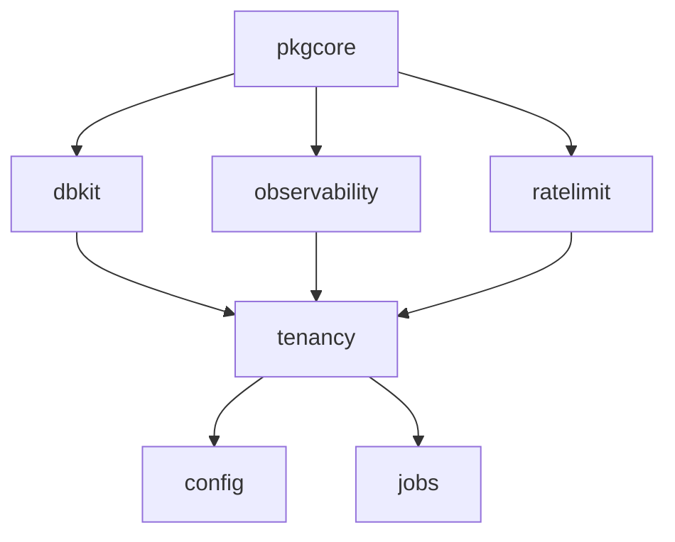

# core 组模块

每个 speed 二进制——以及平台上每个其他 Go 模块——都踩在这七个模块
上。它们之上的东西离开它们就不存在,而消费方是直接 `go get` 它们的:
它们不是你继承的应用框架,而是你调用的库,外加让业务模块把自己注册
进一个二进制的组装契约(`pkgcore` 的 `ComponentRegistry`/`Component`)。

下面各页按该顺序排列:

- [pkgcore](./pkgcore/)——依赖底座:组装契约、租户上下文、基础设施
  模块接口、结构化错误与消息目录。
- [dbkit](./dbkit/)——双方言数据访问:强制的租户级 `Repository[T]`、
  迁移、加密与盲索引。
- [tenancy](./tenancy/)——隔离的输入端:请求携带哪个租户,以及带
  审计的系统上下文逃生口。
- [observability](./observability/)——OpenTelemetry 接线、默认开启
  脱敏的上下文日志器、HTTP 埋点。
- [config](./config/)——schema 先行、数据库承载的设置与功能开关库,
  值可热生效。
- [jobs](./jobs/)——异步任务队列契约及其两个实现:`StandaloneQueue`
  与 Redis 承载的 `queue/asynq`。
- [ratelimit](./ratelimit/)——共享的 KVStore 承载限流器,一次调用
  一个维度。

## 为什么它们垫底

依赖方向就是发布纪律:`pkgcore` 不导入任何其他 speed 模块,根包也
不携带任何第三方依赖,上面每一层只添加自己关切所需的东西。对消费方
这意味着两点。其一,你写的大多数业务模块携带 `Component` 描述符,在
一次 `Register` 声明体里注册路由、配置 schema、权限、事件与任务处理
器——由装配驱动。其二,有几块 core 组件是直接用、不走装配的:`tenancy`
的中间件护住你的 HTTP 入口,`observability.Init` 在进程启动时运行,
`config` 需要每个组件都声明完之后的那次 `Attach`,`jobs` 队列由宿主构造并
启动,`ratelimit` 则是纯库。各页的「接线与最少使用」一节说明各自
属于哪种形态。

基础设施模块的进程内实现(内存版 `KVStore` 与 `EventBus`、控制台
发信器、本地对象存储)同时充当测试替身——这正是平台各模块的默认
测试跑不需要外部服务的原因。
