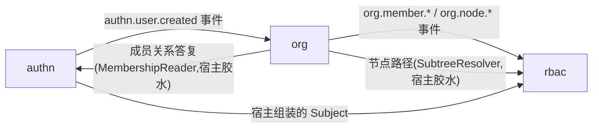

# identity 组模块

这三个 Go 模块是 speed 产品的身份与访问面。按依赖序——也是请求经过的
顺序——它们依次回答:**是谁在调用**(`authn`)、**他能不能做这件事**
(`rbac`)、**能在组织的哪一片里做**(`org`)。三者都直接踩在 core 组
的 `tenancy`/`jobs` 层上,是你组装的库,不是你要运行的应用。

- [authn](./authn/)——认证:调用者是谁,绝不是他能做什么。账号、密码/
  短信/社交/企业登录、Ed25519 访问令牌、刷新轮换、会话、MFA 与 step-up。
- [rbac](./rbac/)——授权:`Subject` 能否对某资源执行某动作,以及能在组
  织树的哪一片里执行。默认拒绝,精确的 `resource:action` 授权,无通配符。
- [org](./org/)——租户的组织树、绑在节点上的成员关系、以及创建它们的邀
  请——两个邻居模块问题背后的数据:authn 失败关闭检查要的成员关系答复,
  rbac 范围授权要的节点 id 与路径。

三个模块之间没有任何一个 import 另一个——依赖图里没有它们之间的边,
这不是疏漏,而是设计。authn 永不 import org:成员关系经宿主的
`MembershipReader` 接缝询问,org 的名册是它的规范实现。rbac 永不
import authn:授权对身份只知一件事——`Subject{TenantID, UserID}`——
由认证方组装。rbac 永不 import org:节点在树里的位置经
`SubtreeResolver` 接缝询问,宿主用 org 的只读 `Scope` 视图实现它。org
永不 import authn:它经 `authn.user.created` 事件得知新用户的存在。把
三个名字放在一起的只有组装它们的宿主——参考应用就是现成的例子。

## 它们如何协同

一次请求就能看出分工。`authn.Middleware` **可选**地校验访问令牌——坏
令牌当场拒绝,没有令牌则保持匿名——并且从不决定租户。`tenancy.Middleware`
把验证过的 principal 变成租户上下文,租户来自令牌自己的声明。需要门禁的
路由接着跑 `rbac.RequirePermission`:回答粗粒度「该租户内是否持此权限」,
失败一律关闭成 403;返回行数据的 handler 还要用 `DataScope` 过滤,其子
树收窄在决策时经 org 的树解析。而整条链背后的账号来自纵向流程:注册发布
`authn.user.created`,org 的订阅者幂等地确保根节点与一条成员关系,一封邀
请把另一个人带进某个节点,下一次登录在签发任何东西之前重新核验这条成员
关系。

## 与其他指南的关系

[身份与访问](/zh-cn/docs/user-guide/domains/identity-access/)与
[租户与组织](/zh-cn/docs/user-guide/domains/tenancy-and-org/)两张领域
页从产品侧走同一片地面;[错误码索引](/docs/user-guide/error-codes/)列出
这三个模块应答的每个码。authn 令牌验签所用的签名密钥来自 services 组的
[pki](/zh-cn/docs/user-guide/modules/services/pki/) 模块;前端对应物——
会话管理、登录界面、租户切换——是 web workspace 的 `@speed` 包,在本参
考文的后段另有文档。还没组装过宿主的话,从 [Quickstart](/zh-cn/docs/quickstart/)
开始:生成的起始项目已经替你接好这三个模块。
